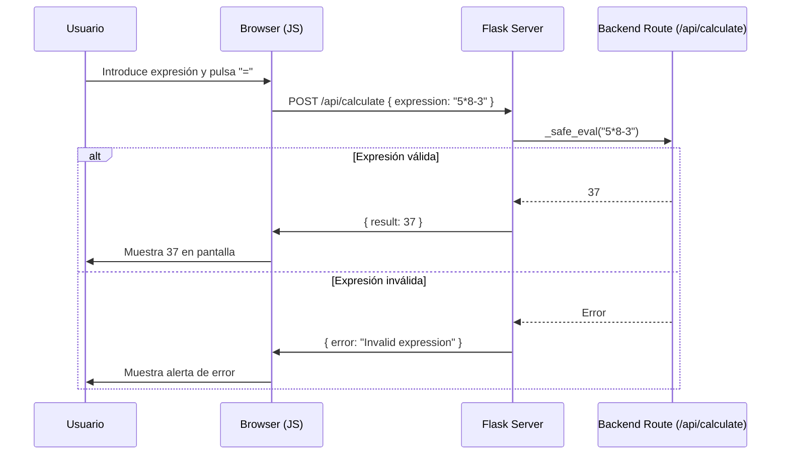

# Visión General del Proyecto

Este proyecto es una **calculadora web** sencilla que combina un backend Flask con una interfaz SPA (Single Page Application) construida en HTML y Bootstrap 5. El objetivo principal es permitir a los usuarios introducir expresiones matemáticas, enviarlas al servidor y mostrar el resultado de forma inmediata.

- **Backend**: Exposea la ruta `/api/calculate` que recibe una expresión JSON, la evalúa de manera segura con AST y devuelve el resultado o un mensaje de error.
- **Frontend**: Una página estática servida por Flask que contiene los botones de la calculadora. Cuando se pulsa “=”, se hace una llamada `POST` al endpoint del backend y se actualiza la pantalla con el valor devuelto.

El flujo es simple:
1. El usuario escribe en la pantalla (interfaz).
2. Al pulsar “=”, se envía la expresión a `/api/calculate`.
3. El servidor evalúa y responde.
4. La respuesta se muestra al usuario o se despliega un mensaje de error.

---

# Arquitectura del Sistema

```
┌───────────────────────┐
│  Cliente (Navegador) │
├─────────────┬─────────┤
│  UI (HTML/JS) │  API   │
│              │ /api/calculate │
└─────▲──────▲──┘
      │      │
      ▼      ▼
 ┌───────────────────────┐
 │     Flask App          │
 │  - create_app()        │
 │  - Blueprint calc_bp   │
 ├─────────────┬─────────┤
 │  Routes     │ Static  │
 │  /api/calc  │ index.html │
 └─────────────┴─────────┘
```

## Componentes Clave

| Componente | Responsabilidad |
|------------|-----------------|
| **app.py** | Punto de entrada que crea la aplicación y la ejecuta en modo debug. |
| **backend/__init__.py** | Configura Flask, registra blueprints y sirve el `index.html`. |
| **backend/routes.py** | Define el blueprint `calc_bp` con la lógica de cálculo seguro (`_safe_eval`). |
| **frontend/index.html** | SPA que maneja la UI y las interacciones del usuario. |
| **tests/test_backend.py** | Test unitarios para asegurar correcto funcionamiento de la API. |

---

# Endpoints de la API

## `/api/calculate` (POST)

| Campo | Tipo | Descripción |
|-------|------|-------------|
| `expression` | string | Expresión matemática a evaluar. Debe ser no vacía y contener solo operadores permitidos (`+`, `-`, `*`, `/`, `**`, `%`, `//`). |

### Respuestas

| Código | Contenido | Ejemplo |
|--------|-----------|---------|
| **200 OK** | `{ "result": <valor> }` | `{ "result": 37 }` |
| **400 Bad Request** | `{ "error": "<mensaje>" }` | `{ "error": "Missing 'expression' field" }` |

### Ejemplo de Solicitud

```bash
curl -X POST http://localhost:5000/api/calculate \
     -H "Content-Type: application/json" \
     -d '{"expression":"5*8-3"}'
```

---

# Instrucciones de Instalación y Ejecución

1. **Clonar el repositorio**  
   ```bash
   git clone <url_del_repositorio>
   cd <nombre_del_directorio>
   ```

2. **Crear entorno virtual (opcional pero recomendado)**  
   ```bash
   python -m venv venv
   source venv/bin/activate  # Windows: venv\Scripts\activate
   ```

3. **Instalar dependencias**  
   ```bash
   pip install -r requirements.txt
   ```

4. **Ejecutar la aplicación**  
   ```bash
   python app.py
   ```
   La calculadora estará disponible en `http://localhost:5000`.

5. **Ejecutar pruebas**  
   ```bash
   pytest tests/test_backend.py
   ```

---

# Flujo de Datos Clave



- **Entrada**: Texto del usuario (ej. `"5*8-3"`).
- **Procesamiento**: `_safe_eval` valida la sintaxis y evalúa con AST, evitando código arbitrario.
- **Salida**: Resultado numérico o mensaje de error JSON.

---

# Extensiones Futuras

| Área | Posible Mejora |
|------|----------------|
| **Seguridad** | Añadir autenticación JWT para limitar uso a usuarios registrados. |
| **Rendimiento** | Cachear resultados de expresiones repetidas usando Redis. |
| **UX** | Implementar historial de cálculos y soporte para funciones trigonométricas. |
| **Testing** | Ampliar pruebas con `pytest` y cobertura de código, incluir tests de UI con Selenium. |
| **Despliegue** | Dockerizar la aplicación (`Dockerfile`) y orquestarla con Docker Compose o Kubernetes. |

---