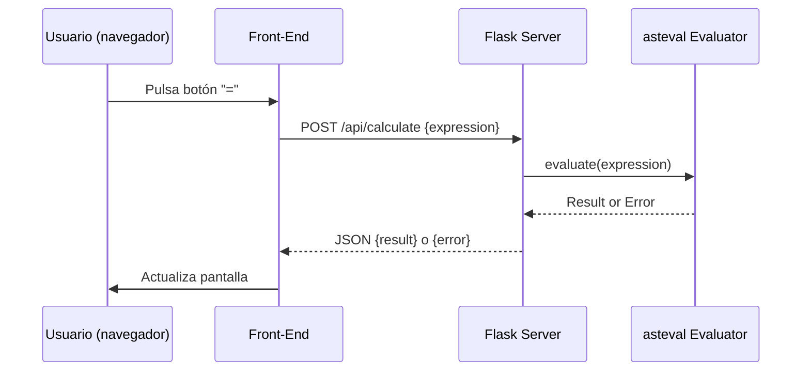

# Visión General del Proyecto

Este proyecto es una calculadora web sencilla que expone una API REST para evaluar expresiones matemáticas y un front‑end minimalista en HTML/Bootstrap que consume ese endpoint. La arquitectura está diseñada para ser ligera, con una única dependencia de Flask y la librería `asteval` que permite evaluar expresiones aritméticas de forma segura sin ejecutar código arbitrario.

El flujo típico es:

1. El usuario escribe una expresión en el teclado virtual del navegador.
2. Al pulsar “=”, el front‑end envía un POST a `/api/calculate` con la expresión JSON‑serializada.
3. Flask recibe la solicitud, valida y evalúa la expresión usando `asteval`.
4. Se devuelve el resultado (o un error) en formato JSON que el cliente muestra en pantalla.

El proyecto incluye pruebas unitarias con pytest para asegurar que los casos de éxito y error se manejan correctamente.

---

# Arquitectura del Sistema

## Componentes principales

| Componente | Descripción | Tecnologías |
|------------|-------------|-------------|
| **Flask App** | Servidor web que expone la API y sirve el front‑end estático. | Flask, Blueprint |
| **API `/api/calculate`** | Endpoint que recibe expresiones y devuelve resultados. | Flask, `asteval` |
| **Front‑End** | Interfaz de usuario en HTML/Bootstrap con JavaScript puro para consumir la API. | Bootstrap 5, Fetch API |
| **Testing** | Conjunto de pruebas unitarias con pytest. | pytest |

## Flujo de datos



---

# Endpoints de la API

## `/api/calculate` – POST

| Atributo | Tipo | Descripción |
|----------|------|-------------|
| `expression` (JSON) | string | Expresión aritmética a evaluar. Debe contener únicamente operadores básicos (`+`, `-`, `*`, `/`) y números. |

### Respuestas

| Código | Contenido | Ejemplo |
|--------|-----------|---------|
| **200 OK** | `{ "result": <valor> }` | `{ "result": 37 }` |
| **400 Bad Request** | `{ "error": "<mensaje>" }` | `{ "error": "Missing 'expression' field" }` |

### Ejemplo de solicitud

```bash
curl -X POST http://localhost:5000/api/calculate \
     -H "Content-Type: application/json" \
     -d '{"expression":"5*8-3"}'
```

---

# Instrucciones de Instalación y Ejecución

1. **Clonar el repositorio**  
   ```bash
   git clone <url_del_repositorio>
   cd <directorio_del_proyecto>
   ```

2. **Crear un entorno virtual (opcional pero recomendado)**  
   ```bash
   python -m venv .venv
   source .venv/bin/activate      # En Windows: .venv\Scripts\activate
   ```

3. **Instalar dependencias**  
   ```bash
   pip install -r requirements.txt
   ```

4. **Ejecutar la aplicación**  
   ```bash
   python run.py
   ```
   La app estará disponible en `http://0.0.0.0:5000/`.

5. **Probar las pruebas unitarias**  
   ```bash
   pytest tests/
   ```

---

# Flujo de Datos Clave

1. **Entrada del usuario**: El front‑end captura cada pulsación y construye una cadena `expression`.
2. **Solicitud HTTP**: Se envía un POST a `/api/calculate` con el cuerpo JSON `{ "expression": "<cadena>" }`.
3. **Validación en Flask**:
   - Verifica que la clave `expression` exista.
   - Asegura que sea una cadena.
4. **Evaluación segura**:
   - Usa `asteval.Interpreter` configurado sin funciones de usuario (`usersyms={}`) y sin soporte NumPy.
   - Si `asteval` detecta un error, se lanza una excepción y la respuesta es 400.
5. **Respuesta**: Se devuelve el resultado numérico o un mensaje de error en JSON.

---

# Extensiones Futuras (Opcional)

| Área | Posible Mejora |
|------|----------------|
| **Seguridad** | Añadir autenticación JWT para proteger el endpoint y evitar abuso. |
| **Soporte Matemático** | Incorporar funciones trigonométricas o logaritmos extendiendo `asteval` con un conjunto de símbolos seguros. |
| **Persistencia** | Guardar historial de cálculos en una base de datos SQLite y exponer un endpoint `/api/history`. |
| **UI/UX** | Implementar React/Vue para una experiencia más dinámica y responsive. |
| **Testing** | Añadir pruebas de integración con `requests` y cobertura de código. |

---