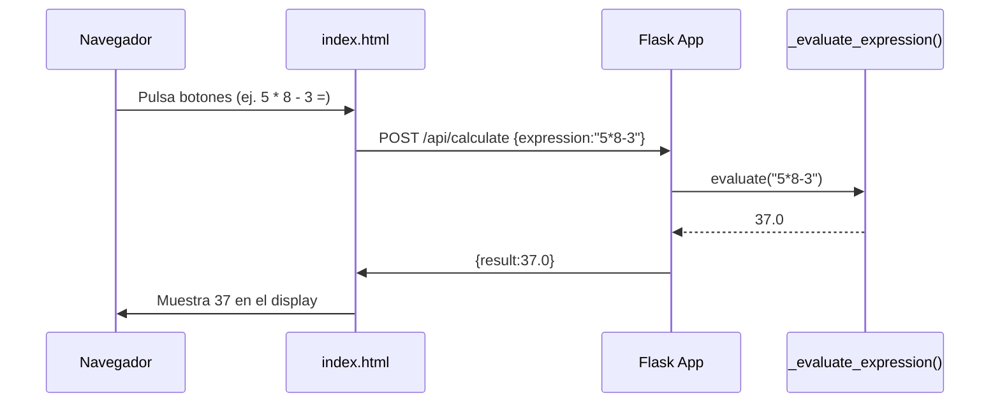

# Visión General del Proyecto

Este proyecto es una **calculadora web** sencilla que combina un backend en Flask con una interfaz de usuario estática servida por el mismo servidor. La lógica principal reside en la evaluación segura de expresiones aritméticas enviadas desde el navegador a través de una API RESTful.

- **Frontend:** Un único archivo `index.html` que utiliza Bootstrap 5 para el diseño y JavaScript puro para manejar los eventos del teclado virtual.
- **Backend:** Una aplicación Flask minimalista con un blueprint dedicado a la ruta `/api/calculate`. La evaluación se realiza mediante `eval`, pero protegida por una expresión regular que permite únicamente dígitos, operadores básicos y paréntesis.
- **Pruebas:** Se incluyen pruebas de pytest que verifican el correcto funcionamiento del endpoint y su manejo de errores.

El objetivo es ofrecer un ejemplo claro de cómo exponer funcionalidad de cálculo a través de HTTP sin necesidad de dependencias externas complejas.

# Arquitectura del Sistema

```mermaid
graph TD
    A[Cliente (Navegador)] -->|HTTP POST /api/calculate| B[Flask App]
    B --> C{Blueprint api}
    C --> D[_evaluate_expression()]
    D --> E[Resultado numérico]
    E --> F[Respuesta JSON]
```

- **Flask App**  
  - Se crea mediante `create_app()` en `backend/__init__.py`.  
  - Sirve archivos estáticos desde la carpeta `../frontend`.  
  - Registra el blueprint `api_bp` con prefijo `/api`.

- **Blueprint `api_bp`** (`backend/routes.py`)  
  - Ruta POST `/calculate`.  
  - Valida que el cuerpo sea JSON y contenga una cadena `expression`.  
  - Llama a `_evaluate_expression()` para obtener el resultado.  
  - Devuelve `{ "result": <float> }` o un error 400 con descripción.

- **Función de Evaluación** (`_evaluate_expression`)  
  - Regex: `^[0-9+\-*/().\s]+$`.  
  - Evalúa la expresión en un contexto sin builtins.  
  - Captura excepciones y las convierte en `ValueError`.

# Endpoints de la API

| Método | Ruta              | Parámetros de Entrada                                 | Respuesta Exitosa                                   | Código de Estado | Descripción |
|--------|-------------------|-------------------------------------------------------|-----------------------------------------------------|------------------|-------------|
| POST   | `/api/calculate`  | JSON: `{ "expression": "<string>" }`                  | `{ "result": <float> }`                            | 200              | Calcula la expresión. |
|        |                   |                                                       |                                                     | 400              | Error de sintaxis o contenido no permitido. |

### Ejemplo de solicitud

```bash
curl -X POST http://localhost:5000/api/calculate \
     -H "Content-Type: application/json" \
     -d '{"expression":"5*8-3"}'
```

Respuesta:

```json
{ "result": 37.0 }
```

### Ejemplo de error

```bash
curl -X POST http://localhost:5000/api/calculate \
     -H "Content-Type: application/json" \
     -d '{"expression":"5*/8"}'
```

Respuesta (código 400):

```json
{ "message": "Failed to evaluate expression: ...", "status": 400 }
```

# Instrucciones de Instalación y Ejecución

1. **Clonar el repositorio**  
   ```bash
   git clone <URL_DEL_REPOSITORIO>
   cd <directorio_del_proyecto>
   ```

2. **Crear entorno virtual (opcional pero recomendado)**  
   ```bash
   python -m venv .venv
   source .venv/bin/activate  # Windows: .\.venv\Scripts\activate
   ```

3. **Instalar dependencias**  
   ```bash
   pip install -r requirements.txt
   ```

4. **Ejecutar la aplicación en modo desarrollo**  
   ```bash
   python app.py
   ```
   La aplicación escuchará en `http://0.0.0.0:5000`.

5. **Probar desde el navegador**  
   Abrir `http://localhost:5000` y usar la calculadora.

6. **Ejecutar pruebas unitarias**  
   ```bash
   pytest tests/test_backend.py
   ```

# Flujo de Datos Clave



1. **Entrada del usuario** – Se construye la expresión a medida que se pulsan los botones.
2. **Envío al backend** – Cuando se pulsa `=`, el frontend envía una petición POST con la expresión.
3. **Evaluación segura** – El backend valida y evalúa la expresión, retornando un número flotante.
4. **Respuesta al cliente** – Se devuelve JSON que contiene el resultado, que luego se muestra en el display.

# Extensiones Futuras (Opcional)

| Área | Posible Mejora | Justificación |
|------|----------------|---------------|
| Seguridad | Validar expresiones con `asteval` o `sympy` | Evitar uso de `eval`, mayor robustez. |
| Rendimiento | Cachear resultados frecuentes con `functools.lru_cache` | Reducir cálculo repetido en sesiones largas. |
| Usabilidad | Añadir historial y soporte para funciones trigonométricas | Enriquecer experiencia del usuario. |
| API | Implementar autenticación JWT | Permitir usar la calculadora en aplicaciones externas. |
| Frontend | Migrar a un framework SPA (React/Vue) | Mejor manejo de estado y pruebas unitarias del UI. |

Estas extensiones podrían implementarse sin alterar significativamente la arquitectura actual, manteniendo el núcleo de la API intacto.