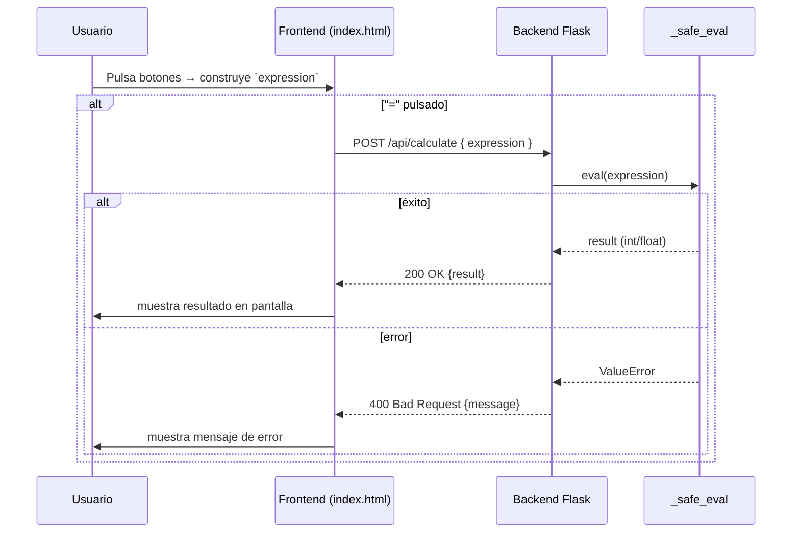

# Visión General del Proyecto
El proyecto es una **calculadora web** sencilla que combina un backend Flask con un frontend HTML/JavaScript puro.  
- El *backend* expone una única ruta `/api/calculate` que recibe una expresión aritmética en JSON, la valida y devuelve el resultado.  
- El *frontend* muestra una interfaz de calculadora con botones y una pantalla; al pulsar “=”, envía la expresión al backend y muestra el resultado o un mensaje de error.

El objetivo principal es demostrar un flujo completo: entrada del usuario → petición HTTP → procesamiento seguro en Python → respuesta JSON → actualización dinámica del DOM.

---

# Arquitectura del Sistema
```mermaid
graph LR
    A[Usuario] -->|HTTP POST| B[/api/calculate]
    B --> C[_safe_eval()]
    C --> D{Resultado}
    D -->|OK| E[JSON {result}]
    D -->|Error| F[JSON {message}]
    B --> G[Flask app]
    G --> H[Blueprint calc_bp]
    G --> I[Rutas estáticas] 
```

## Componentes principales
| Componente | Descripción |
|------------|-------------|
| **`app.py`** | Punto de entrada que crea la aplicación Flask y la ejecuta en modo debug. |
| **`backend/__init__.py`** | Contiene el *factory* `create_app`, la definición del Blueprint `calc_bp` y la función `_safe_eval`. |
| **`frontend/index.html`** | UI estática con estilos CSS y lógica JavaScript para interactuar con la API. |
| **`tests/test_backend.py`** | Testes unitarios que verifican el comportamiento de la ruta `/api/calculate`. |

---

# Endpoints de la API
| Método | Ruta | Parámetros | Respuesta Exitosa | Código de Estado | Mensaje de Error |
|--------|------|------------|-------------------|------------------|------------------|
| **POST** | `/api/calculate` | `{"expression": "5*8-3"}` | `{"result": 37}` | `200 OK` | `400 Bad Request` con descripción (`Missing 'expression' field`, `Expression must be a non-empty string`, `Invalid expression: ...`). |

> **Nota**: El cuerpo debe ser JSON; la clave obligatoria es `expression`.

---

# Instrucciones de Instalación y Ejecución
1. Clona el repositorio o copia los archivos en un directorio local.  
2. Instala las dependencias:
   ```bash
   pip install -r requirements.txt
   ```
3. Ejecuta la aplicación:
   ```bash
   python app.py
   ```
4. Accede al navegador en `http://127.0.0.1:5000/`.  
5. Para ejecutar los tests:
   ```bash
   pytest tests/test_backend.py
   ```

---

# Flujo de Datos Clave


1. **Entrada**: El usuario escribe una expresión mediante los botones del frontend.  
2. **Validación local**: Se comprueba que la cadena contenga solo caracteres permitidos (`0-9`, `+ - * / . ( )`).  
3. **Petición al backend**: Se envía un JSON con la expresión.  
4. **Evaluación segura**: `_safe_eval` restringe el conjunto de caracteres y utiliza `eval` con `__builtins__` vacío para evitar código arbitrario.  
5. **Respuesta**: El backend devuelve el resultado o un mensaje de error, que el frontend muestra en la pantalla.

---

# Extensiones Futuras (Opcional)
- **Persistencia**: Añadir una base de datos SQLite para registrar historial de cálculos por usuario.  
- **Autenticación**: Implementar JWT para proteger la API y asociar resultados a cuentas.  
- **Soporte avanzado**: Incluir funciones matemáticas (`sin`, `cos`, etc.) con un parser más robusto (p.ej., `asteval`).  
- **Frontend React/Vue**: Migrar el UI a un framework SPA para mayor interactividad y pruebas unitarias de componentes.  

---