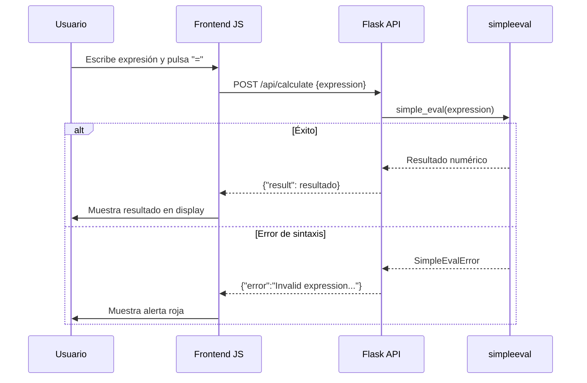

# Visión General del Proyecto

Este proyecto es una **calculadora web** sencilla que combina un frontend ligero en HTML/CSS/JavaScript con un backend Flask que expone una API REST para evaluar expresiones matemáticas de forma segura. El flujo típico es:

1. El usuario escribe una expresión a través de la interfaz gráfica.
2. Cuando pulsa el botón “=”, el cliente envía esa cadena al endpoint `/api/calculate`.
3. El servidor evalúa la expresión usando `simpleeval`, devuelve el resultado y el frontend lo muestra en pantalla.

El objetivo principal es demostrar un patrón minimalista de *frontend + API* con pruebas automatizadas para garantizar la fiabilidad del cálculo.

---

# Arquitectura del Sistema

## Diagrama de Componentes (Mermaid)

```mermaid
graph TD
    A[Usuario] -->|HTTP GET| B[Flask App]
    B --> C{Static Files}
    C --> D[index.html]
    D --> E[JavaScript]
    E --> F[/api/calculate POST]
    F --> G[Flask Route]
    G --> H[simpleeval]
    H --> I[Resultado JSON]
```

## Detalle de los Componentes

| Componente | Descripción |
|------------|-------------|
| **Frontend** | Un único `index.html` con Bootstrap 5. Contiene la lógica del visor y botones, así como las llamadas AJAX a la API. |
| **Backend (Flask)** | - `create_app()` configura la app y registra el blueprint.<br>- Blueprint `/api` contiene la ruta `/calculate`. |
| **Evaluador** | `simpleeval.simple_eval` evalúa expresiones numéricas sin permitir código arbitrario. Maneja excepciones propias (`SimpleEvalError`) y genéricas. |
| **Pruebas** | `tests/test_backend.py` usa PyTest para validar respuestas correctas e inválidas. |

---

# Endpoints de la API

## Tabla de Endpoints

| Método | Ruta | Parámetros | Respuesta Exitosa | Código de Estado | Descripción |
|--------|------|------------|-------------------|------------------|-------------|
| `POST` | `/api/calculate` | JSON: `{ "expression": "<string>" }` | `{ "result": <number> }` | 200 | Evalúa la expresión y devuelve el resultado. |
|        |      |            | `{ "error": "<mensaje>" }` | 400 | Expresión inválida o tipo incorrecto. |
|        |      |            | `{ "error": "<mensaje>" }` | 500 | Error inesperado durante la evaluación. |

## Ejemplo de Solicitud

```bash
curl -X POST http://localhost:5000/api/calculate \
     -H 'Content-Type: application/json' \
     -d '{"expression":"12/(3+1)"}'
```

Respuesta:

```json
{
  "result": 3.0
}
```

---

# Instrucciones de Instalación y Ejecución

1. **Clonar el repositorio**  
   ```bash
   git clone https://github.com/tu-usuario/calc-web.git
   cd calc-web
   ```

2. **Crear entorno virtual (opcional pero recomendado)**  
   ```bash
   python3 -m venv venv
   source venv/bin/activate  # Windows: venv\Scripts\activate
   ```

3. **Instalar dependencias**  
   ```bash
   pip install -r requirements.txt
   ```

4. **Ejecutar el servidor Flask**  
   ```bash
   export FLASK_APP=backend/__init__.py
   flask run
   ```
   (En Windows: `set FLASK_APP=backend\__init__.py`)

5. **Abrir la aplicación**  
   Navega a `http://127.0.0.1:5000/` en tu navegador.

6. **Ejecutar pruebas unitarias**  
   ```bash
   pytest tests/
   ```

---

# Flujo de Datos Clave



---

# Extensiones Futuras (Opcional)

| Área | Idea | Justificación |
|------|------|---------------|
| **Persistencia de Historial** | Guardar expresiones y resultados en una base de datos SQLite. | Permitir al usuario revisar cálculos previos y exportarlos. |
| **Autenticación JWT** | Añadir registro/login con tokens. | Proteger la API contra uso abusivo y permitir perfiles personalizados. |
| **Soporte para Funciones Matemáticas** | Extender `simpleeval` con funciones como `sin`, `cos`, `sqrt`. | Ampliar el rango de cálculos sin romper la seguridad. |
| **API RESTful Avanzada** | Añadir endpoints `/history`, `/clear-history`. | Facilitar operaciones CRUD sobre los registros de cálculo. |
| **Frontend React/Vue** | Reescribir UI con un framework moderno. | Mejorar experiencia de usuario y modularidad del código. |

---