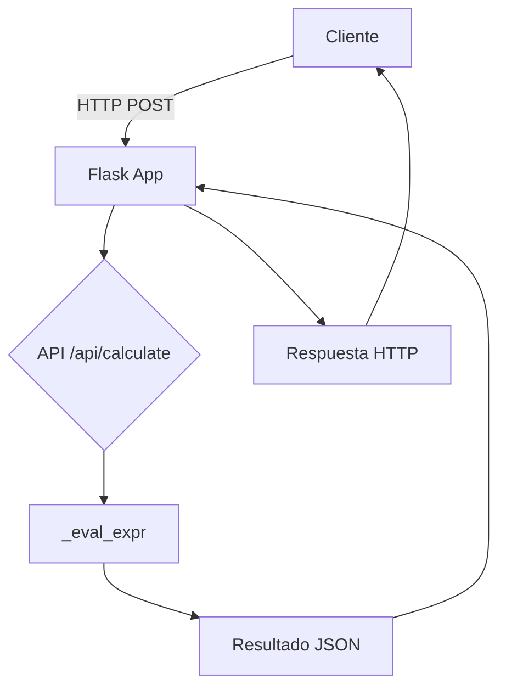

# Visión General del Proyecto

Este repositorio contiene una **calculadora web** funcional que separa la lógica de cálculo en el servidor y la interfaz de usuario en un único archivo HTML.

El flujo típico es:

- El usuario escribe una expresión matemática (ej.: `5*8-3`) mediante los botones de la calculadora.
- Al pulsar **=**, la expresión se envía al backend a través de una llamada **POST /api/calculate**.
- El servidor evalúa la expresión de forma segura y devuelve el resultado en JSON.
- La interfaz actualiza la pantalla con el valor obtenido.

El proyecto está organizado en dos paquetes principales:

| Carpeta | Descripción |
|---------|-------------|
| `backend/` | Contiene la aplicación Flask, las rutas y la lógica de evaluación segura. |
| `frontend/` | Un único archivo `index.html` con HTML/CSS/JS que actúa como SPA. |

El backend no requiere base de datos; todo el estado es transitorio.

# Arquitectura del Sistema



**Componentes Clave**:

- **Flask App**: `backend/app.py` crea la aplicación con la ruta raíz que sirve `index.html`.
- **Blueprint API**: `backend/routes.py` define el endpoint `/calculate` y contiene `_eval_expr`, una función recursiva que evalúa solo operaciones aritméticas permitidas usando el módulo `ast`.
- **Frontend SPA**: `frontend/index.html` incluye lógica JavaScript para construir la expresión, enviarla al backend y mostrar el resultado.

# Endpoints de la API

| Método | Ruta | Descripción | Parámetros | Respuesta | Código HTTP |
|--------|------|-------------|------------|-----------|--------------|
| POST | `/api/calculate` | Calcula una expresión matemática. | `expression`: string con la expresión a evaluar. | `{ "result": <number> }` o `{ "error": "mensaje" }` | 200 OK (éxito), 400 Bad Request, 422 Unprocessable Entity |

### Ejemplo de Solicitud

```http
POST /api/calculate HTTP/1.1
Content-Type: application/json

{ "expression": "5*8-3" }
```

### Respuesta Exitosa

```json
{ "result": 37 }
```

# Instrucciones de Instalación y Ejecución

1. **Clonar el repositorio**:

   ```bash
   git clone https://github.com/albertomzai/calculator.git
   cd calculator
   ```

2. **Crear un entorno virtual (opcional pero recomendado)**:

   ```bash
   python -m venv venv
   source venv/bin/activate  # Windows: venv\Scripts\activate
   ```

3. **Instalar dependencias**:

   ```bash
   pip install -r requirements.txt
   ```

4. **Ejecutar la aplicación**:

   ```bash
   python app.py
   ```

5. **Acceder a la calculadora**: Abrir un navegador y navegar a `http://localhost:5000`.

# Flujo de Datos Clave

| Paso | Acción | Entrada | Salida |
|------|--------|---------|--------|
| 1 | Usuario pulsa botón en la UI | Valor del botón (ej.: `7`, `+`) | Se concatena a la expresión actual |
| 2 | Pulsa `=` | Expresión completa (`5*8-3`) | Envío POST al backend |
| 3 | Backend evalúa | AST de la expresión | Resultado numérico o error |
| 4 | Respuesta HTTP | JSON con `{ "result": ... }` | Se muestra en pantalla |

# Extensiones Futuras (Opcional)

- **Persistencia**: Añadir una base de datos para registrar historial de cálculos.
- **Soporte de funciones trigonométricas**: Extender `_eval_expr` con `math.sin`, `math.cos`, etc.
- **Internationalización**: Soportar múltiples idiomas en la UI.
- **Testing Frontend**: Implementar pruebas unitarias con Jest o Cypress.
- **Dockerizar**: Crear un `Dockerfile` y `docker-compose.yml` para despliegue sencillo.