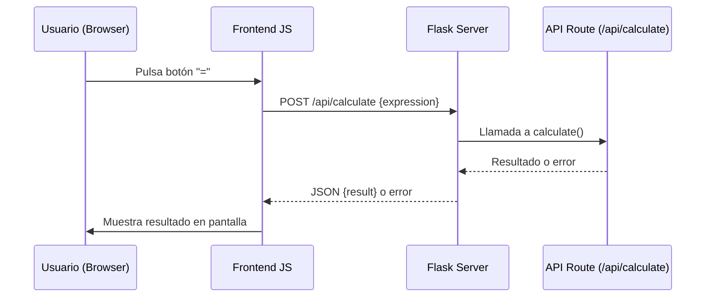
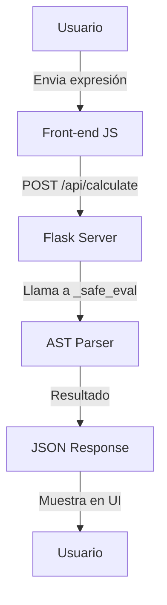

# Visión General del Proyecto
Esta aplicación es una **calculadora web** sencilla que combina un frontend estático con una API RESTful de Flask para evaluar expresiones matemáticas. El flujo típico es:

1. El usuario escribe la expresión en el navegador a través de botones de UI.
2. Cuando pulsa “=”, el JavaScript envía una petición POST al endpoint `/api/calculate`.
3. El backend evalúa la expresión de forma segura y devuelve el resultado como JSON.
4. La página muestra el resultado o un mensaje de error.

El proyecto está pensado para ser ligero, con dependencias mínimas (solo Flask) y sin requerir bases de datos ni lógica compleja en el servidor.

# Arquitectura del Sistema
```
┌───────────────────────┐          HTTP/1.1          ┌───────────────────────┐
│  Navegador Web        │<─────────────────────────>│    Flask Application   │
├───────────────────────┤                              ├───────────────────────┤
│ index.html (static)   │◄─────────────────────────►│  backend/__init__.py   │
│ JavaScript UI         │          POST /api/calc   │  backend/routes.py     │
└───────────────────────┘                          └───────────────────────┘
```

## Componentes Principales

| Componente | Descripción |
|------------|-------------|
| **Frontend** | `frontend/index.html` con Bootstrap 5 y JavaScript puro. Sirve como UI estática a través del directorio `static_folder` de Flask. |
| **Backend** | Paquete `backend` que contiene la lógica de negocio: creación de app (`create_app`) y rutas API (`api_bp`). |
| **API** | Endpoint `/api/calculate` que recibe expresiones en JSON, las valida con un AST seguro y devuelve el resultado. |

## Flujo de Petición



# Endpoints de la API

| Método | Ruta | Descripción | Parámetros | Respuesta |
|--------|------|-------------|------------|-----------|
| **POST** | `/api/calculate` | Evalúa una expresión matemática. | `{"expression": "<string>"}` | `200 OK`: `{"result": <float>}`<br>`400 Bad Request`: Mensaje de error en JSON |

### Ejemplo de Solicitud

```bash
curl -X POST http://localhost:5000/api/calculate \
     -H "Content-Type: application/json" \
     -d '{"expression":"5*8-3"}'
```

Respuesta:

```json
{
  "result": 37
}
```

### Código de la Ruta

```python
@api_bp.route('/calculate', methods=['POST'])
def calculate():
    data = request.get_json(silent=True)
    if not data or 'expression' not in data:
        abort(400, description="Missing 'expression' field")

    expr = data['expression']
    if not isinstance(expr, str) or not expr.strip():
        abort(400, description="Expression must be a non-empty string")

    try:
        result = _safe_eval(expr)
    except ValueError as e:
        abort(400, description=str(e))

    return jsonify({"result": result})
```

# Instrucciones de Instalación y Ejecución
1. **Clonar el repositorio**  
   ```bash
   git clone https://github.com/tu-usuario/calculadora-web.git
   cd calculadora-web
   ```

2. **Crear entorno virtual (opcional pero recomendado)**  
   ```bash
   python -m venv venv
   source venv/bin/activate  # Windows: venv\Scripts\activate
   ```

3. **Instalar dependencias**  
   ```bash
   pip install -r requirements.txt
   ```

4. **Ejecutar la aplicación**  
   ```bash
   python app.py
   ```
   La API estará disponible en `http://0.0.0.0:5000` y el frontend en `http://localhost:5000`.

5. **Probar los tests** (opcional)  
   ```bash
   pytest tests/test_backend.py
   ```

# Flujo de Datos Clave



- **Entrada**: Expresión matemática como cadena (`"5*8-3"`).
- **Procesamiento**:
  - Se parsea con `ast.parse`.
  - Se valida que solo existan nodos permitidos.
  - Se evalúa con `eval` en un entorno vacío.
- **Salida**: Resultado numérico o error descriptivo.

# Extensiones Futuras (Opcional)

| Área | Posible Mejora |
|------|----------------|
| **Seguridad** | Implementar una capa de autenticación JWT para limitar el uso a usuarios registrados. |
| **Persistencia** | Añadir un historial de cálculos guardado en SQLite y exponerlo vía `/api/history`. |
| **Validaciones Avanzadas** | Soportar funciones matemáticas (`sin`, `cos`) con un conjunto controlado de módulos. |
| **Frontend React/Vue** | Migrar la UI a un framework moderno para mejorar la experiencia móvil y modularidad. |
| **Dockerización** | Crear un Dockerfile que exponga la app en un contenedor reproducible. |

---