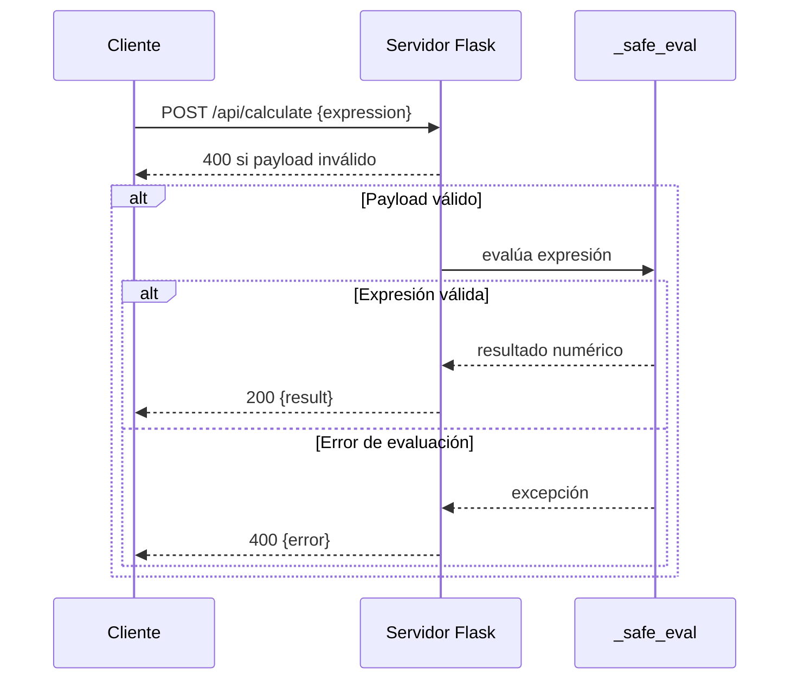

# Visión General del Proyecto

Este proyecto es una **API REST** minimalista que expone un único endpoint `/api/calculate`. Su objetivo principal es evaluar expresiones matemáticas recibidas en formato JSON y devolver el resultado numérico. La lógica de evaluación está implementada con la librería `ast` de Python para garantizar que solo se ejecuten operaciones aritméticas básicas, evitando cualquier riesgo de inyección de código.

El proyecto sigue una arquitectura típica de Flask:

- **Blueprints**: Separamos las rutas de cálculo en un blueprint (`calc_bp`) y lo registramos dentro de la aplicación principal.
- **Frontend SPA**: La carpeta `frontend` (no incluida aquí) contiene el cliente web que consume el endpoint. El servidor sirve el archivo `index.html` como punto de entrada de la Single Page Application.

---

# Arquitectura del Sistema

| Componente | Descripción |
|------------|-------------|
| **Flask App (`create_app`)** | Instancia principal, configura rutas estáticas y registra blueprints. |
| **Blueprint `calc_bp`** | Agrupa las rutas relacionadas con el cálculo de expresiones. |
| **Función `_safe_eval`** | Analiza la expresión con `ast`, valida nodos permitidos y evalúa de forma segura. |
| **Endpoint `/api/calculate`** | Recibe JSON, valida payload y devuelve resultado o error. |

```mermaid
flowchart TD
    A[Cliente] --> B{Solicitud HTTP}
    B --> C[/api/calculate]
    C --> D[_safe_eval]
    D --> E[Resultado / Error]
    E --> F[Respuesta JSON]
```

---

# Endpoints de la API

| Método | Ruta | Parámetros | Respuesta Exitosa | Código de Estado | Descripción |
|--------|------|------------|-------------------|------------------|-------------|
| **POST** | `/api/calculate` | `application/json`<br>`{ "expression": "<string>" }` | `{ "result": <number> }` | 200 OK | Evalúa la expresión matemática. |
| | | | `{ "error": "<mensaje>" }` | 400 Bad Request | Entrada inválida o sintaxis incorrecta. |

**Ejemplo de petición**

```http
POST /api/calculate HTTP/1.1
Content-Type: application/json

{
  "expression": "(2 + 3) * 4 - 5 / (1 + 1)"
}
```

**Respuesta esperada**

```json
{
  "result": 19.5
}
```

---

# Instrucciones de Instalación y Ejecución

1. **Clonar el repositorio**
   ```bash
   git clone https://github.com/tu-usuario/calculator-api.git
   cd calculator-api
   ```

2. **Crear entorno virtual (opcional pero recomendado)**
   ```bash
   python3 -m venv .venv
   source .venv/bin/activate  # En Windows: .venv\Scripts\activate
   ```

3. **Instalar dependencias**
   ```bash
   pip install -r requirements.txt
   ```
   *Si no existe un `requirements.txt`, instala Flask manualmente:*
   ```bash
   pip install flask
   ```

4. **Configurar variables de entorno (opcional)**
   ```bash
   export FLASK_APP=app.py  # o el nombre del archivo que contiene create_app()
   export FLASK_ENV=development
   ```

5. **Ejecutar la aplicación**
   ```bash
   flask run
   ```
   La API estará disponible en `http://127.0.0.1:5000/api/calculate` y el frontend (si está presente) en `http://127.0.0.1:5000/`.

---

# Flujo de Datos Clave



1. El cliente envía una solicitud POST con la expresión.
2. Flask valida el JSON y extrae `expression`.
3. `_safe_eval` parsea y evalúa la expresión de forma segura.
4. Se devuelve el resultado o un mensaje de error.

---

# Extensiones Futuras

| Área | Posible Mejora |
|------|----------------|
| **Seguridad** | Añadir autenticación JWT para limitar el acceso al endpoint. |
| **Soporte Matemático** | Incluir funciones trigonométricas y logarítmicas mediante un conjunto de nodos permitidos adicional. |
| **Persistencia** | Guardar historial de cálculos en una base de datos (SQLite/PostgreSQL). |
| **Testing** | Implementar pruebas unitarias con `pytest` para `_safe_eval` y los endpoints. |
| **Documentación API** | Generar Swagger/OpenAPI automáticamente usando `flasgger`. |

---