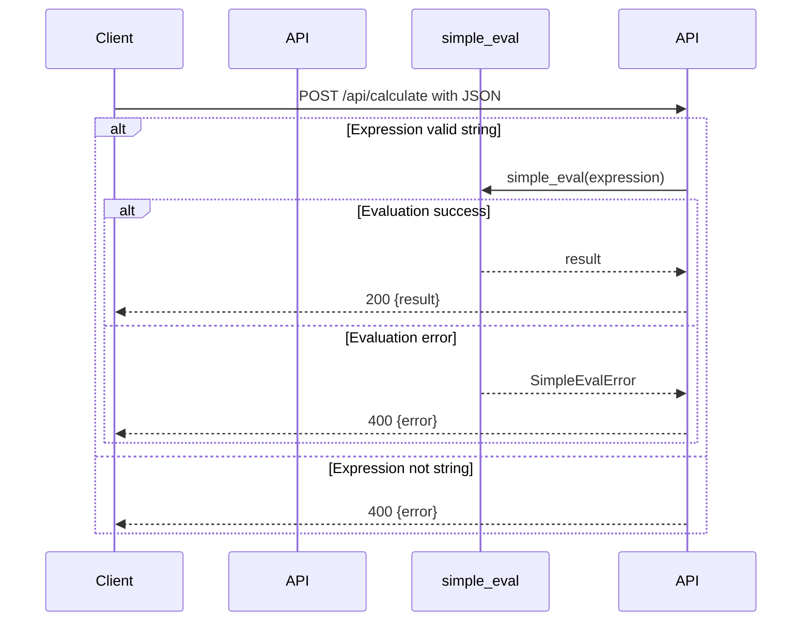

# Visión General del Proyecto

Este proyecto es una pequeña aplicación web que expone un **endpoint REST** para evaluar expresiones matemáticas de forma segura y devuelve el resultado al cliente. La lógica se implementa en Flask, mientras que la evaluación de las expresiones utiliza la librería `simpleeval`, la cual garantiza que solo se ejecuten operaciones aritméticas básicas sin riesgo de inyección de código.

El flujo típico es:

1. El usuario envía una petición **POST** a `/api/calculate` con un JSON que contiene el campo `"expression"`.
2. La API valida que el valor sea una cadena.
3. Se evalúa la expresión usando `simple_eval`. Si la sintaxis es inválida, se devuelve un error 400; si ocurre otro fallo inesperado, se devuelve un error 500.
4. En caso de éxito, se responde con un JSON `{ "result": <valor> }`.

El front‑end (no incluido en el código) se sirve desde la carpeta `../frontend`, donde se encuentra un archivo `index.html` que actúa como punto de entrada.

---

# Arquitectura del Sistema

```
┌───────────────────────┐
│  Cliente Web          │
├─────────────┬─────────┤
│ HTTP        │  JSON   │
│ (POST)      │         │
└───────▲─────┴───────▲──┘
        │             │
        ▼             ▼
┌───────────────────────┐
│ Flask Application     │
├─────────────┬─────────┤
│ Blueprint   │ /api    │
│ routes.py   │         │
├─────────────┴─────────┤
│ simpleeval (Python)  │
└───────────────────────┘
```

## Componentes Clave

| Componente | Responsabilidad |
|------------|-----------------|
| **Flask** | Servidor HTTP, manejo de rutas y respuestas. |
| **Blueprint `api_bp`** | Agrupa las rutas relacionadas con la API (`/calculate`). |
| **`simpleeval.simple_eval`** | Evaluador seguro de expresiones aritméticas. |
| **Front‑end static files** | Sirven como interfaz de usuario a través de `/`. |

---

# Endpoints de la API

## `POST /api/calculate`

Evalúa una expresión matemática segura.

### Request
```http
POST /api/calculate HTTP/1.1
Content-Type: application/json

{
  "expression": "2 + 3 * (4 - 1)"
}
```

| Campo | Tipo   | Obligatorio | Descripción |
|-------|--------|-------------|-------------|
| `expression` | string | Sí | La expresión aritmética a evaluar. |

### Response
- **200 OK**  
  ```json
  { "result": 11 }
  ```
- **400 Bad Request**  
  - Expresión no es una cadena: `{ "error": "Expression must be a string." }`  
  - Expresión inválida: `{ "error": "Invalid expression: <details>" }`
- **500 Internal Server Error**  
  ```json
  { "error": "Evaluation error: <details>" }
  ```

### Mermaid Diagram



---

# Instrucciones de Instalación y Ejecución

1. **Clonar el repositorio**  
   ```bash
   git clone <url-del-repositorio>
   cd <nombre-del-proyecto>
   ```

2. **Crear entorno virtual (opcional pero recomendado)**  
   ```bash
   python3 -m venv .venv
   source .venv/bin/activate  # En Windows: .venv\Scripts\activate
   ```

3. **Instalar dependencias**  
   ```bash
   pip install -r requirements.txt
   ```
   > Si no existe un `requirements.txt`, instala manualmente:  
   > `pip install Flask simpleeval`

4. **Configurar variables de entorno (si aplica)**  
   No se requieren variables específicas para este proyecto.

5. **Ejecutar la aplicación**  
   ```bash
   export FLASK_APP=app.py  # o el nombre del archivo que contiene create_app()
   flask run --host=0.0.0.0 --port=5000
   ```
   > La ruta `/` servirá `index.html` desde `../frontend`.

6. **Probar el endpoint**  
   ```bash
   curl -X POST http://localhost:5000/api/calculate \
        -H "Content-Type: application/json" \
        -d '{"expression":"5*3+2"}'
   ```

---

# Flujo de Datos Clave

```mermaid
flowchart TD
    A[Cliente] -->|POST /api/calculate (JSON)| B[Flask Endpoint]
    B -->|Valida tipo string| C{Es cadena?}
    C -- Sí --> D[simple_eval(expression)]
    D -->|Resultado numérico| E{Éxito?}
    E -- Sí --> F[Respuesta 200 JSON {result}]
    E -- No --> G[Respuesta 400 JSON {error: "Invalid expression"}]
    C -- No --> H[Respuesta 400 JSON {error: "Expression must be a string."}]
    D -->|Error inesperado| I[Respuesta 500 JSON {error: "Evaluation error"}]
```

1. **Recepción**: El cliente envía la expresión.
2. **Validación**: Se comprueba que el campo sea una cadena.
3. **Evaluación**: `simple_eval` procesa la expresión y devuelve un número o lanza una excepción.
4. **Respuesta**: Según el resultado, se emite un JSON con el valor o un mensaje de error.

---

# Extensiones Futuras (Opcional)

| Área | Posible Mejora |
|------|----------------|
| **Seguridad** | Añadir autenticación JWT para limitar quién puede evaluar expresiones. |
| **Validaciones Avanzadas** | Restringir operadores permitidos y longitud máxima de la expresión. |
| **Persistencia** | Guardar historial de cálculos en una base de datos (SQLite/PostgreSQL). |
| **Front‑end** | Implementar un SPA con React/Vue que consuma el endpoint y muestre resultados en tiempo real. |
| **Testing** | Añadir pruebas unitarias para `calculate()` usando `pytest` y `flask.testing`. |
| **Documentación** | Generar Swagger/OpenAPI automáticamente con `flasgger` o `connexion`. |

---