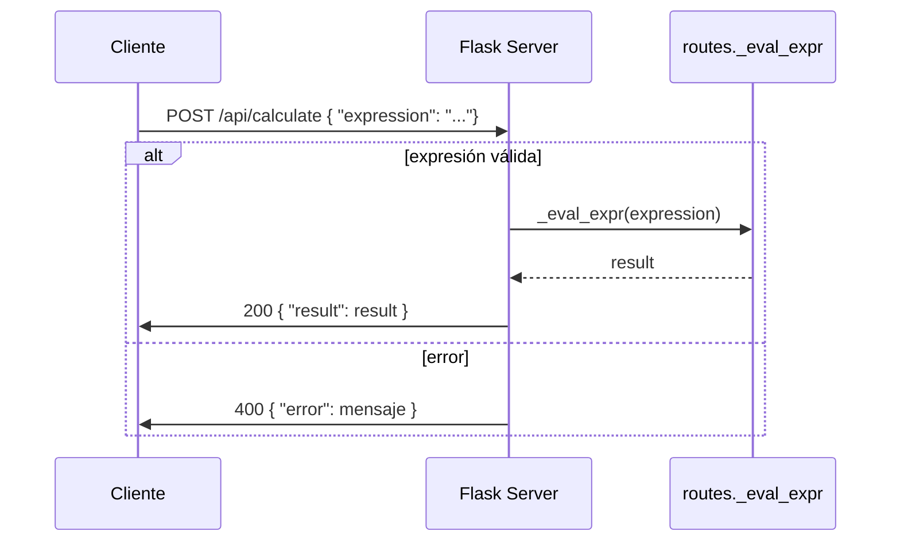

# Visión General del Proyecto

El proyecto es una API sencilla construida con **Flask** que expone un único endpoint `/api/calculate`. Su objetivo principal es recibir expresiones matemáticas en formato JSON, evaluarlas de forma segura y devolver el resultado. La aplicación también sirve una interfaz web estática (ubicada en la carpeta `frontend`) a través del mismo servidor Flask.

- **Tecnologías principales**: Python 3, Flask 2.x.
- **Dependencias**: `Flask==2.3.2`, `pytest==7.4.0`.
- **Estructura de paquetes**:
  - `app.py`: punto de entrada para ejecutar la aplicación en modo desarrollo.
  - `__init__.py`: crea y configura la instancia Flask, registra blueprints y rutas estáticas.
  - `routes.py`: contiene el blueprint con la lógica del endpoint `/calculate`.
  - `requirements.txt`: lista las dependencias.

El flujo de trabajo típico es:
1. El cliente envía una petición POST a `/api/calculate` con un JSON que incluye `"expression"`.
2. Flask procesa la solicitud, valida y evalúa la expresión.
3. Se devuelve un JSON con el resultado o un mensaje de error.

---

# Arquitectura del Sistema

La arquitectura sigue un patrón **MVC ligero**:

| Componente | Responsabilidad |
|------------|-----------------|
| `app.py`   | Punto de entrada; arranca el servidor Flask. |
| `__init__.py` | Configuración de la aplicación y registro de blueprints. |
| `routes.py` | Lógica del endpoint `/calculate`; incluye validación y evaluación segura. |
| Frontend (static) | Página HTML que consume la API (no incluido en el código fuente). |

El servidor Flask actúa como **gateway** entre el cliente HTTP y la lógica de negocio, manteniendo una separación clara entre la capa de presentación (frontend estático) y la capa de servicio (API).

---

# Endpoints de la API

## `/api/calculate` – POST

| Atributo | Tipo | Descripción |
|----------|------|-------------|
| `expression` | string | Expresión matemática que se evaluará. Debe contener solo operadores aritméticos básicos (`+`, `-`, `*`, `/`) y paréntesis. |

### Respuestas

| Código | Cuerpo | Descripción |
|--------|--------|-------------|
| 200 OK | `{ "result": <number> }` | Resultado de la evaluación. |
| 400 Bad Request | `{ "error": "<mensaje>" }` | Expresión inválida o error durante la evaluación. |

### Ejemplo

```bash
curl -X POST http://localhost:5000/api/calculate \
     -H 'Content-Type: application/json' \
     -d '{"expression":"(2+3)*4"}'
```

Respuesta:

```json
{ "result": 20 }
```

---

# Instrucciones de Instalación y Ejecución

1. **Clonar el repositorio**  
   ```bash
   git clone <URL_DEL_REPOSITORIO>
   cd <nombre_del_repositorio>
   ```

2. **Crear un entorno virtual (opcional pero recomendado)**  
   ```bash
   python3 -m venv .venv
   source .venv/bin/activate  # En Windows: .venv\Scripts\activate
   ```

3. **Instalar dependencias**  
   ```bash
   pip install -r requirements.txt
   ```

4. **Ejecutar la aplicación en modo desarrollo**  
   ```bash
   python app.py
   ```
   La API estará disponible en `http://0.0.0.0:5000/`.

5. **Probar el endpoint (ejemplo con curl)**  
   ```bash
   curl -X POST http://localhost:5000/api/calculate \
        -H 'Content-Type: application/json' \
        -d '{"expression":"10/(2+3)"}'
   ```

---

# Flujo de Datos Clave



1. **Cliente** envía la expresión.
2. Flask recibe la solicitud y extrae el JSON.
3. Se llama a `_eval_expr`, que:
   - Analiza el AST de la expresión.
   - Verifica que solo contenga nodos permitidos.
   - Evalúa de forma segura sin `__builtins__`.
4. El resultado (o error) se devuelve al cliente en formato JSON.

---

# Extensiones Futuras

| Área | Posible Mejora |
|------|----------------|
| **Seguridad** | Implementar un *sandbox* más robusto o usar una librería especializada como `asteval` para evitar vulnerabilidades. |
| **Soporte de funciones** | Añadir funciones matemáticas (`sin`, `cos`, `sqrt`) con validación explícita. |
| **Persistencia** | Guardar historial de cálculos en una base de datos (SQLite) y exponer endpoints CRUD. |
| **Documentación automática** | Integrar Swagger/OpenAPI mediante `flask-restx` para generar documentación interactiva. |
| **Pruebas** | Ampliar el conjunto de pruebas unitarias con `pytest` y cubrir casos edge. |

---