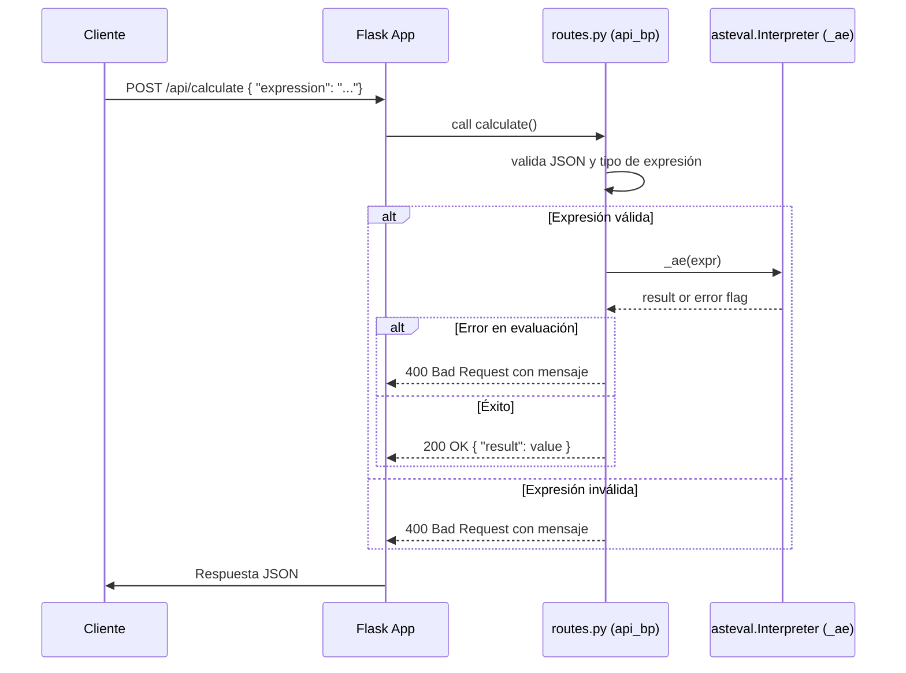

# Visión General del Proyecto

Este proyecto es una pequeña API RESTful construida con **Flask** que expone un único endpoint `/api/calculate`. El objetivo principal es recibir expresiones matemáticas en formato de cadena JSON y devolver el resultado evaluado de forma segura, evitando la ejecución de código arbitrario. Para lograr esto se utiliza la librería `asteval`, que permite evaluar expresiones aritméticas básicas sin exponer funcionalidades peligrosas.

El flujo típico para un cliente es:
1. Enviar una petición POST a `/api/calculate` con un cuerpo JSON que contenga el campo `"expression"`.
2. El servidor valida la presencia y tipo del dato, evalúa la expresión de manera segura y devuelve el resultado en formato JSON.
3. Si algo falla (falta el campo, tipo incorrecto o expresión inválida), se devuelve un error 400 con un mensaje descriptivo.

El proyecto está pensado como una base minimalista que puede integrarse fácilmente dentro de aplicaciones más grandes o servir como prototipo para servicios de cálculo dinámico.

---

# Arquitectura del Sistema

```
+---------------------+
|   Cliente HTTP      |
+----------+----------+
           |
           v
+---------------------+          +-----------------+
|  Flask Application  | <------> |  asteval Eval   |
+----------+----------+          +--------+--------+
           |                               ^
           |                               |
           |        API Blueprint (routes) |
           +-----------+-------------------+
                       |
                       v
              /api/calculate (POST)
```

## Componentes Clave

| Componente | Responsabilidad | Tecnologías |
|------------|-----------------|-------------|
| `create_app()` | Inicializa la aplicación Flask, registra blueprints y manejadores de errores. | Flask |
| `api_bp` (routes.py) | Define el endpoint `/api/calculate`. Valida entrada, evalúa expresión y devuelve respuesta JSON. | Flask Blueprint, asteval |
| `_ae` (`asteval.Interpreter`) | Evaluador seguro que permite operaciones aritméticas básicas sin acceso a funciones globales ni módulos externos. | asteval |

---

# Endpoints de la API

## `/api/calculate`

| Método | URL | Descripción |
|--------|-----|-------------|
| **POST** | `/api/calculate` | Evalúa una expresión matemática enviada en el cuerpo JSON. |

### Requisitos del Request

| Campo | Tipo | Obligatorio | Descripción |
|-------|------|-------------|-------------|
| `expression` | `string` | Sí | La expresión aritmética a evaluar (ej.: `"2 + 3 * (4 - 1)"`). |

#### Ejemplo de Payload
```json
{
  "expression": "12 / (2 + 4) * 3"
}
```

### Respuestas

| Código | Tipo | Cuerpo |
|--------|------|--------|
| **200 OK** | `application/json` | `{ "result": <valor> }` |
| **400 Bad Request** | `application/json` | `{ "error": "<mensaje>" }` |

#### Ejemplo de Respuesta Exitosa
```json
{
  "result": 6.0
}
```

#### Ejemplo de Error (Expresión inválida)
```json
{
  "error": "Invalid expression"
}
```

### Detalles Técnicos

- La evaluación se realiza con `asteval.Interpreter(usersyms={}, err_writer=None, use_numpy=False)`.
- Se deshabilita la escritura de errores (`err_writer=None`) y el uso de NumPy para mantener la seguridad.
- Si `asteval` detecta un error durante la evaluación (`_ae.error`), se lanza una excepción que resulta en un 400.

---

# Instrucciones de Instalación y Ejecución

1. **Clonar el repositorio**  
   ```bash
   git clone https://github.com/tu-usuario/proyecto-calculadora.git
   cd proyecto-calculadora
   ```

2. **Crear y activar un entorno virtual (opcional pero recomendado)**  
   ```bash
   python -m venv .venv
   source .venv/bin/activate  # En Windows: .\.venv\Scripts\activate
   ```

3. **Instalar dependencias**  
   ```bash
   pip install -r requirements.txt
   ```
   > Si no existe `requirements.txt`, crea uno con:
   > ```text
   > Flask==2.3.*
   > asteval==0.9.*
   > ```

4. **Ejecutar la aplicación en modo desarrollo**  
   ```bash
   export FLASK_APP=app.py  # o el nombre del archivo que contiene create_app()
   flask run --debugger
   ```
   - La API estará disponible en `http://127.0.0.1:5000/api/calculate`.

5. **Probar el endpoint**  
   ```bash
   curl -X POST http://127.0.0.1:5000/api/calculate \
        -H "Content-Type: application/json" \
        -d '{"expression": "3 + 4 * 2"}'
   ```

---

# Flujo de Datos Clave



- **Entrada**: Cliente envía expresión.
- **Validación**: `routes.py` comprueba la presencia y tipo del campo `"expression"`.
- **Evaluación**: Se pasa a `_ae`, que devuelve el resultado o marca error.
- **Respuesta**: Flask envía 200 con el resultado o 400 con detalle de error.

---

# Extensiones Futuras

| Área | Posible Mejora |
|------|----------------|
| Seguridad | Añadir un whitelist de funciones matemáticas (p.ej., `sqrt`, `log`) y limitar operadores. |
| Rendimiento | Cachear resultados de expresiones repetidas usando Redis o memcached. |
| Usabilidad | Implementar soporte para variables (`x`, `y`) con valores pasados en el JSON. |
| Documentación | Generar Swagger/OpenAPI automáticamente a partir de los blueprints. |
| Frontend | Integrar una SPA (React/Vue) que consuma la API y muestre resultados interactivos. |

---