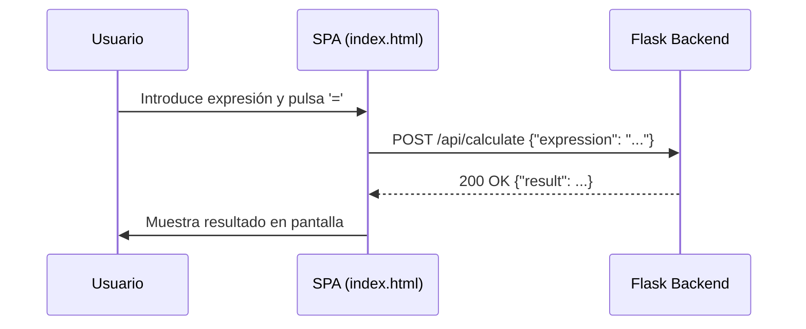

# Visión General del Proyecto

El proyecto **calculator** es una calculadora web que separa la lógica de cálculo en un backend Python con Flask y ofrece una API RESTful para evaluar expresiones matemáticas. La aplicación no requiere base de datos, ya que los cálculos son volátiles y se procesan directamente en memoria.

## Flujo General

- El cliente (SPA) envía la expresión a través de **POST /api/calculate**.
- El backend valida la entrada, analiza la expresión con el módulo `ast` para evitar evaluaciones inseguras y devuelve el resultado o un error.
- La SPA muestra el resultado en la pantalla de la calculadora.

# Arquitectura del Sistema

La arquitectura sigue un patrón **Monolito ligero**:

```mermaid
graph TD;
  A[Cliente (SPA)] -->|POST /api/calculate| B[Flask App];
  B --> C{Evaluación Segura};
  C --> D[Resultado];
  D -->|JSON| A;
```

### Componentes Clave

| Componente | Descripción | Ruta de Código |
|------------|-------------|----------------|
| `app.py`   | Inicializa la aplicación Flask y registra blueprints. | `calculator/app.py` |
| `routes.py`| Define la lógica del endpoint `/calculate`. | `calculator/routes.py` |
| `__init__.py` | Factory de la app, configuración del static folder y ruta raíz. | `calculator/__init__.py` |

# Endpoints de la API

## POST /api/calculate

### Descripción
- Recibe una expresión matemática como string.
- Evalúa la expresión de forma segura usando el módulo `ast`.
- Devuelve un JSON con el resultado o un mensaje de error.

| Método | Ruta | Tipo de Contenido | Respuesta Exitosa | Código de Estado |
|--------|------|-------------------|--------------------|------------------|
| POST   | /api/calculate | application/json | {"result": 37} | 200 OK |

### Ejemplo de Solicitud

```http
POST /api/calculate HTTP/1.1
Content-Type: application/json

{
  "expression": "5*8-3"
}
```

### Ejemplo de Respuesta

```json
{
  "result": 37
}```

### Manejo de Errores

| Código | Mensaje | Descripción |
|--------|---------|-------------|
| 400    | `'expression' must be a string` | Entrada no válida. |
| 422    | `Invalid expression` | Expresión mal formada. |
| 422    | `division by zero` | División por cero detectada. |

# Instrucciones de Instalación y Ejecución

1. **Clonar el repositorio**:

   ```bash
   git clone https://github.com/albertomzai/calculator.git
   cd calculator
   ```

2. **Crear un entorno virtual (opcional pero recomendado)**:

   ```bash
   python -m venv .venv
   source .venv/bin/activate  # Windows: .venv\Scripts\activate
   ```

3. **Instalar dependencias**:

   ```bash
   pip install -r requirements.txt
   ```

4. **Ejecutar la aplicación**:

   ```bash
   export FLASK_APP=calculator.app
   flask run --host=0.0.0.0 --port=5000
   ```

5. **Acceder a la calculadora**:

   Abrir un navegador y navegar a `http://localhost:5000`. La SPA se servirá desde el directorio `frontend`.

# Flujo de Datos Clave



# Extensiones Futuras (Opcional)

- **Persistencia**: Añadir una base de datos para historial de cálculos.
- **Autenticación**: Implementar JWT para usuarios registrados.
- **Cálculo avanzado**: Soporte para funciones trigonométricas, logaritmos y exponenciales.
- **Internationalización**: Soportar múltiples idiomas en la interfaz.
- **Testing**: Añadir pruebas unitarias y de integración con pytest.