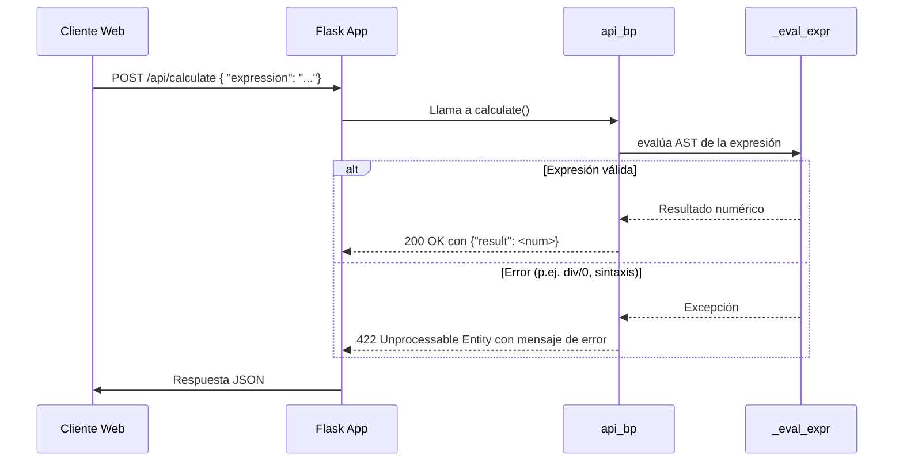

# Visión General del Proyecto

Este proyecto es una pequeña API REST desarrollada con **Flask** que expone un único endpoint `/api/calculate`. Su propósito principal es recibir una expresión matemática en formato de cadena, evaluarla de manera segura y devolver el resultado numérico. El front‑end está servido como archivos estáticos desde la carpeta `frontend`, permitiendo a los usuarios interactuar con la API mediante un navegador.

El flujo típico es:

1. Un cliente (por ejemplo, un formulario HTML) envía una petición **POST** a `/api/calculate` con el cuerpo JSON `{ "expression": "2 + 3 * 4" }`.
2. La aplicación parsea la cadena usando el módulo `ast` de Python, construyendo un árbol sintáctico abstracto.
3. Se evalúa recursivamente solo los nodos permitidos (`+`, `-`, `*`, `/`, `**`, y unary minus), garantizando que no se ejecute código arbitrario.
4. El resultado (o un mensaje de error) se devuelve en formato JSON.

El proyecto está pensado como una base para demostrar técnicas de evaluación segura, servir contenido estático con Flask y estructurar una aplicación simple pero extensible.

---

# Arquitectura del Sistema

```
┌─────────────────────┐
│     Cliente Web     │
├───────────────▲─────┤
│               │     │
│  HTTP/HTTPS   │     │
│               ▼     │
└───────┬───────┘     │
        │             │
        ▼             │
 ┌───────────────────────┐
 │  Flask Application    │
 │  (create_app())       │
 │                       │
 │  +-----------------+  │
 │  | api_bp Blueprint│  │
 │  +-----------------+  │
 │          │            │
 │          ▼            │
 │   /api/calculate      │
 │          │            │
 │          ▼            │
 │  _eval_expr (AST)     │
 │          │            │
 │          ▼            │
 │   JSON Response       │
 └───────────────────────┘
```

### Componentes Clave

| Componente | Responsabilidad |
|------------|-----------------|
| **`create_app()`** | Configura la aplicación Flask, registra blueprints y sirve archivos estáticos. |
| **Blueprint `api_bp`** | Agrupa las rutas de la API bajo el prefijo `/api`. |
| **Endpoint `/calculate`** | Recibe expresiones matemáticas, valida entrada y devuelve resultados o errores. |
| **Función `_eval_expr()`** | Evalúa recursivamente un AST restringido a operaciones aritméticas básicas, evitando ejecución de código malicioso. |

---

# Endpoints de la API

## `POST /api/calculate`

### Descripción
Evalúa una expresión matemática segura y devuelve el resultado.

| Campo | Tipo | Obligatorio | Descripción |
|-------|------|-------------|-------------|
| `expression` | string | Sí | La expresión aritmética a evaluar (p.ej. `"3 + 4 * 2"`). |

### Respuestas

| Código | Payload | Comentario |
|--------|---------|------------|
| **200 OK** | `{ "result": <number> }` | Resultado de la evaluación. |
| **400 Bad Request** | `{ "error": "'expression' must be a string" }` | El campo `expression` no es una cadena. |
| **422 Unprocessable Entity** | `{ "error": "<mensaje>" }` | Cualquier error de validación o cálculo (p.ej., división por cero, expresión inválida). |

### Ejemplo

```http
POST /api/calculate HTTP/1.1
Content-Type: application/json

{
  "expression": "(2 + 3) * 4 - 5 / 0"
}
```

Respuesta:

```json
{
  "error": "division by zero"
}
```

---

# Instrucciones de Instalación y Ejecución

1. **Clonar el repositorio**  
   ```bash
   git clone https://github.com/tu_usuario/tu_repositorio.git
   cd tu_repositorio
   ```

2. **Crear un entorno virtual (opcional pero recomendado)**  
   ```bash
   python3 -m venv venv
   source venv/bin/activate   # En Windows: venv\Scripts\activate
   ```

3. **Instalar dependencias**  
   ```bash
   pip install -r requirements.txt
   ```
   *(Si no existe `requirements.txt`, instalar Flask manualmente)*

4. **Ejecutar la aplicación en modo desarrollo**  
   ```bash
   export FLASK_APP=app.py
   flask run --debug
   ```
   La API estará disponible en `http://127.0.0.1:5000/api/calculate` y el front‑end en `http://127.0.0.1:5000/`.

---

# Flujo de Datos Clave



1. **Recepción**: El cliente envía la expresión en el cuerpo JSON.
2. **Parseo**: `ast.parse` convierte la cadena en un árbol sintáctico (`mode='eval'`).
3. **Evaluación segura**: `_eval_expr()` recorre el AST, permitiendo solo operadores aritméticos básicos y constantes numéricas.
4. **Resultado o error**: Se devuelve una respuesta JSON con el resultado calculado o un mensaje de error apropiado.

---

# Extensiones Futuras

| Área | Posible Mejora |
|------|----------------|
| **Soporte de funciones matemáticas** | Añadir nodos `ast.Call` para funciones predefinidas (`sin`, `cos`, `sqrt`) con una whitelist segura. |
| **Persistencia de resultados** | Guardar cada cálculo en una base de datos (SQLite/PostgreSQL) junto a metadata (timestamp, usuario). |
| **Autenticación y autorización** | Implementar JWT o sesiones para limitar el uso de la API a usuarios autenticados. |
| **Rate limiting** | Evitar abuso añadiendo un middleware que limite peticiones por IP/usuario. |
| **Documentación automática** | Generar Swagger/OpenAPI con `flask-restx` o `apispec`. |

---