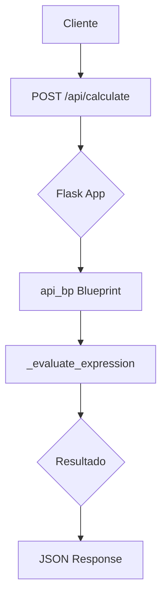
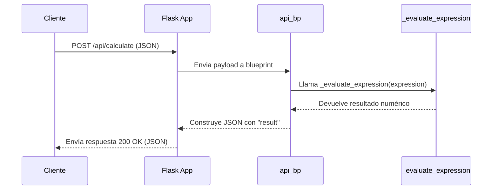

# Visión General del Proyecto

Este proyecto es una **API de cálculo** sencilla construida con Flask. Su objetivo principal es recibir expresiones matemáticas en formato JSON, evaluarlas de manera segura y devolver el resultado. La API está pensada para ser consumida por un frontend que se sirve desde la carpeta `../frontend`, lo que permite desplegar tanto el backend como el cliente en una sola aplicación monolítica.

## Características clave

| Funcionalidad | Descripción |
|---------------|-------------|
| **Entrada** | Recibe un objeto JSON con la clave `"expression"` que contiene una cadena con la expresión aritmética. |
| **Validación** | Utiliza una expresión regular para garantizar que solo se acepten dígitos, operadores básicos (`+`, `-`, `*`, `/`), paréntesis y espacios. |
| **Evaluación segura** | Emplea `eval` con un diccionario vacío de globals y sin acceso a `__builtins__` para evitar la ejecución de código malicioso. |
| **Respuesta** | Devuelve un JSON con la clave `"result"` que contiene el valor numérico calculado. |
| **Manejo de errores** | Responde con HTTP 400 en caso de formato incorrecto, expresión no válida o error durante la evaluación. |

El flujo es muy lineal: el cliente envía una solicitud POST a `/api/calculate`, el servidor valida y evalúa la expresión, y devuelve el resultado.

---

# Arquitectura del Sistema

La arquitectura se basa en un patrón **MVC ligero** donde Flask actúa como controlador y la lógica de negocio está encapsulada en funciones auxiliares. La aplicación consta de los siguientes componentes principales:

| Componente | Ubicación | Responsabilidad |
|------------|-----------|-----------------|
| `create_app` | `__init__.py` | Configura el objeto `Flask`, registra blueprints y sirve archivos estáticos. |
| `api_bp` | `routes.py` | Blueprint que agrupa las rutas de la API (`/calculate`). |
| `_evaluate_expression` | `routes.py` | Función utilitaria que valida y evalúa expresiones matemáticas. |

## Diagrama Mermaid



---

# Endpoints de la API

## `/api/calculate` (POST)

| Elemento | Descripción |
|----------|-------------|
| **URL** | `/api/calculate` |
| **Método** | `POST` |
| **Headers requeridos** | `Content-Type: application/json` |
| **Cuerpo de la solicitud** | ```json { "expression": "<string>" }``` |
| **Respuesta exitosa (200)** | ```json { "result": <float> }``` |
| **Errores comunes** | 400 – “Request must be JSON”<br>400 – “‘expression’ must be a string”<br>400 – “Expression contains unsafe characters”<br>400 – “Failed to evaluate expression: …” |

### Ejemplo de uso

```bash
curl -X POST http://localhost:5000/api/calculate \
     -H "Content-Type: application/json" \
     -d '{"expression": "(2+3)*4"}'
```

Respuesta:

```json
{ "result": 20.0 }
```

---

# Instrucciones de Instalación y Ejecución

1. **Clonar el repositorio**  
   ```bash
   git clone https://github.com/tu_usuario/proyecto_calculadora.git
   cd proyecto_calculadora/backend
   ```

2. **Crear un entorno virtual (opcional pero recomendado)**  
   ```bash
   python -m venv venv
   source venv/bin/activate  # En Windows: venv\Scripts\activate
   ```

3. **Instalar dependencias**  
   ```bash
   pip install flask
   ```

4. **Ejecutar la aplicación**  
   ```bash
   export FLASK_APP=__init__.py
   flask run
   ```
   La API estará disponible en `http://127.0.0.1:5000/api/calculate`.  
   El frontend (si existe) se servirá desde la carpeta `../frontend`.

---

# Flujo de Datos Clave



1. **Recepción**: El cliente envía la expresión en un cuerpo JSON.
2. **Validación de formato**: Flask verifica que el contenido sea JSON y contenga una cadena `"expression"`.
3. **Sanitización**: `_evaluate_expression` comprueba la expresión contra la regex `_SAFE_EXPR_REGEX`.
4. **Evaluación**: Se evalúa la expresión con `eval`, garantizando seguridad mediante un entorno vacío.
5. **Respuesta**: El resultado se envía de vuelta como JSON.

---

# Extensiones Futuras

| Posible mejora | Motivo |
|----------------|--------|
| **Soporte para funciones trigonométricas y logarítmicas** | Ampliaría la utilidad del API más allá de operaciones básicas. |
| **Persistencia de historial** | Almacenar las expresiones calculadas permitiría análisis posterior o reuso. |
| **Autenticación JWT** | Proteger el endpoint con tokens para evitar abusos y controlar acceso. |
| **Documentación Swagger/OpenAPI** | Facilitaría la integración con clientes auto-generados. |

---