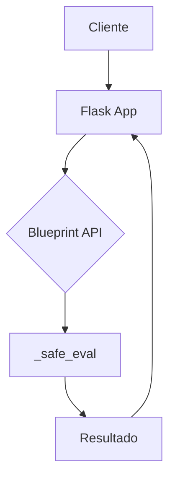
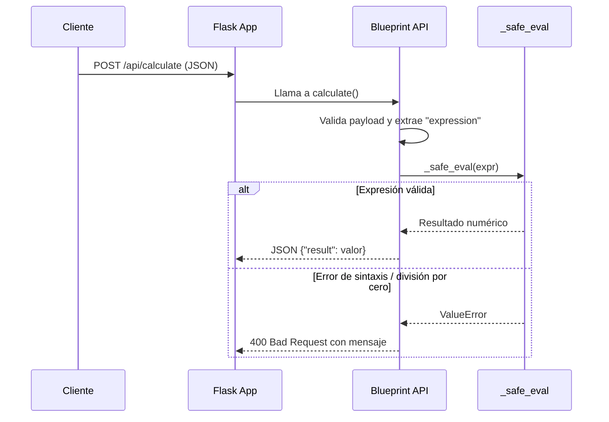

# Visión General del Proyecto

El proyecto es una **API de cálculo** sencilla construida con Flask que expone un único endpoint `/api/calculate`. Su objetivo principal es recibir expresiones matemáticas en formato string, evaluarlas de manera segura y devolver el resultado numérico. El backend está pensado para ser ligero, fácil de desplegar y extensible, sirviendo como base para aplicaciones más complejas o integraciones con frontends modernos.

El flujo típico del usuario es:

1. **Cliente** envía una petición `POST` a `/api/calculate` con un JSON que contiene la expresión.
2. **Servidor** valida la entrada, evalúa la expresión usando un parser AST seguro y devuelve el resultado en formato JSON.
3. En caso de error (sintaxis inválida, división por cero, etc.) se responde con un código `400 Bad Request` y un mensaje descriptivo.

Este enfoque garantiza que solo operaciones aritméticas básicas (+, -, *, /, ^) sean permitidas, evitando la ejecución de código arbitrario.

---

# Arquitectura del Sistema

La arquitectura sigue el patrón **MVC simplificado**:

- **Modelo**: No hay modelos persistentes; todo se procesa en memoria.
- **Vista**: La API expone JSON; no renderiza plantillas HTML.
- **Controlador**: `routes.py` contiene la lógica de negocio y la validación.

El proyecto consta de dos módulos principales:

| Módulo | Descripción |
|--------|-------------|
| `__init__.py` | Crea y configura la aplicación Flask, registra el blueprint. |
| `routes.py` | Define el blueprint `api_bp`, la función `_safe_eval` y el endpoint `/calculate`. |

## Diagrama de componentes (Mermaid)



---

# Endpoints de la API

| Método | Ruta           | Descripción                                 | Parámetros de Entrada                     | Respuesta Exitosa | Código de Error |
|--------|----------------|---------------------------------------------|-------------------------------------------|-------------------|-----------------|
| POST   | `/api/calculate` | Evalúa una expresión matemática.            | `{"expression": "5*8-3"}`                 | `{"result": 37}`  | 400 (Bad Request) |

## Detalle de la respuesta

```json
{
  "result": 37
}
```

El campo `result` siempre será un número (int o float). En caso de error, se devuelve:

```json
{
  "message": "Error description"
}
```

con el código HTTP correspondiente.

---

# Instrucciones de Instalación y Ejecución

1. **Clonar el repositorio**  
   ```bash
   git clone https://github.com/tu_usuario/calculator-backend.git
   cd calculator-backend/backend
   ```

2. **Crear un entorno virtual**  
   ```bash
   python3 -m venv .venv
   source .venv/bin/activate  # En Windows: .venv\Scripts\activate
   ```

3. **Instalar dependencias**  
   ```bash
   pip install -r requirements.txt
   ```
   *(Si no existe `requirements.txt`, crear uno con `Flask==2.1.2` o la versión deseada.)*

4. **Ejecutar la aplicación en modo desarrollo**  
   ```bash
   export FLASK_APP=__init__.py  # En Windows: set FLASK_APP=__init__.py
   flask run --port 5000
   ```

5. **Probar el endpoint**  
   ```bash
   curl -X POST http://localhost:5000/api/calculate \
        -H "Content-Type: application/json" \
        -d '{"expression":"12/(2+4)"}'
   ```
   Resultado esperado:
   ```json
   {"result": 2.0}
   ```

---

# Flujo de Datos Clave



1. **Entrada**: JSON con clave `expression`.
2. **Procesamiento**:
   - Se analiza el AST para asegurar que solo se usan operadores aritméticos y literales numéricos.
   - Si la expresión contiene nodos no permitidos, se lanza `ValueError`.
3. **Salida**: Resultado numérico en JSON o error 400 con descripción.

---

# Extensiones Futuras (Opcional)

| Área | Posible Mejora |
|------|----------------|
| Seguridad | Añadir un *sandbox* más robusto usando `asteval` o `numexpr`. |
| Rendimiento | Cachear resultados de expresiones repetidas con `functools.lru_cache`. |
| Funcionalidad | Soportar funciones matemáticas (`sin`, `cos`) y constantes (`pi`). |
| Documentación | Generar Swagger/OpenAPI automáticamente con `flasgger`. |
| Frontend | Integrar un SPA (React/Vue) en el mismo repositorio bajo `/frontend`. |

---