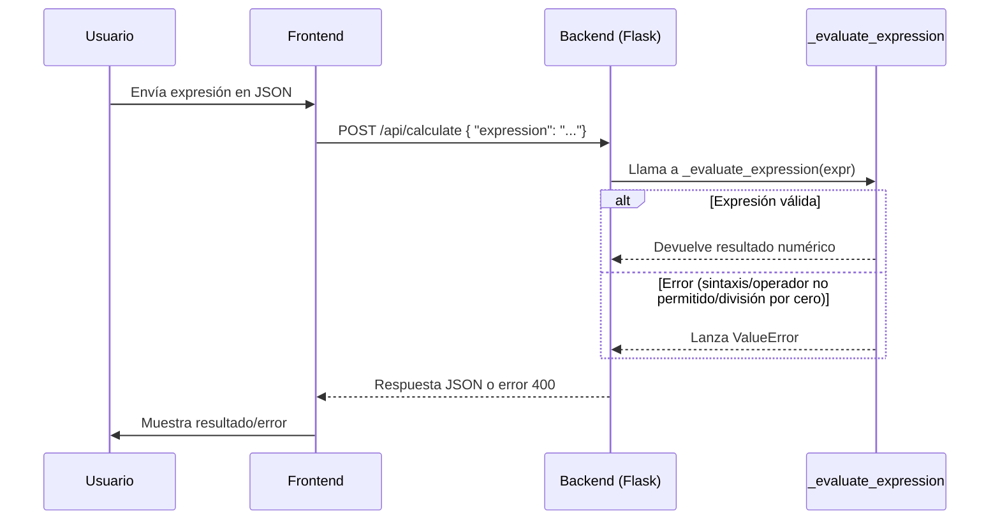

# Visión General del Proyecto

Este proyecto es una aplicación web ligera que expone un **endpoint de cálculo** mediante Flask. Su objetivo principal es recibir expresiones aritméticas en formato JSON, evaluarlas de forma segura y devolver el resultado numérico. La lógica de evaluación se implementa con la biblioteca `ast` para evitar la ejecución de código arbitrario, permitiendo únicamente operaciones básicas (`+`, `-`, `*`, `/`) sobre literales numéricos.

El front‑end (no incluido en el volcado) se sirve desde la carpeta `frontend`. La API está organizada bajo el prefijo `/api`, lo que permite una separación clara entre recursos estáticos y servicios de backend.

---

# Arquitectura del Sistema

La arquitectura sigue un patrón clásico **Flask + Blueprint**:

| Componente | Responsabilidad |
|------------|-----------------|
| `create_app` (en `__init__.py`) | Configura la aplicación Flask, registra blueprints y sirve archivos estáticos. |
| `api_bp` (en `routes.py`) | Contiene las rutas de la API (`/calculate`). |
| `_evaluate_expression` | Función interna que valida y evalúa expresiones usando AST. |

```
┌───────────────────────┐
│  Flask Application     │
│  ├─ Static Files       │
│  └─ /api Blueprint     │
│        └─ /calculate   │
└───────────────────────┘
```

---

# Endpoints de la API

## `/api/calculate` (POST)

| Elemento | Tipo | Descripción |
|----------|------|-------------|
| `Content-Type` | `application/json` | El cuerpo debe ser JSON. |
| Payload | `{ "expression": "<string>" }` | Expresión aritmética a evaluar. |
| Respuesta | `200 OK` con `{ "result": <number> }` | Resultado de la evaluación. |
| Errores | `400 Bad Request` | Mensaje descriptivo del fallo (ej.: sintaxis inválida, división por cero). |

### Ejemplo

```bash
curl -X POST http://localhost:5000/api/calculate \
     -H "Content-Type: application/json" \
     -d '{"expression":"(2+3)*4"}'
```

Respuesta:

```json
{ "result": 20 }
```

---

# Instrucciones de Instalación y Ejecución

1. **Clonar el repositorio**  
   ```bash
   git clone https://github.com/tu_usuario/calculator-backend.git
   cd calculator-backend
   ```

2. **Crear un entorno virtual**  
   ```bash
   python3 -m venv .venv
   source .venv/bin/activate  # En Windows: .venv\Scripts\activate
   ```

3. **Instalar dependencias**  
   ```bash
   pip install -r requirements.txt
   ```

4. **Ejecutar la aplicación**  
   ```bash
   export FLASK_APP=calculator_backend  # o set FLASK_APP=calculator_backend en Windows
   flask run
   ```
   La API estará disponible en `http://localhost:5000/api/calculate` y el front‑end en `http://localhost:5000/`.

---

# Flujo de Datos Clave



1. El usuario envía una expresión a través del front‑end.  
2. Flask recibe la petición POST y valida que el cuerpo sea JSON.  
3. Se extrae el campo `expression` y se pasa a `_evaluate_expression`.  
4. La función analiza el AST, permite solo nodos seguros y evalúa el resultado.  
5. El resultado (o un error 400) se devuelve al front‑end.

---

# Extensiones Futuras

| Área | Posible Mejora |
|------|----------------|
| **Seguridad** | Añadir autenticación JWT para proteger la API. |
| **Rendimiento** | Cachear resultados de expresiones repetidas usando Redis. |
| **Funcionalidad** | Soportar funciones matemáticas (`sin`, `cos`) y constantes (`pi`). |
| **Testing** | Implementar pruebas unitarias con pytest y cobertura. |
| **Documentación** | Generar OpenAPI/Swagger UI automáticamente desde los decoradores de Flask. |

---