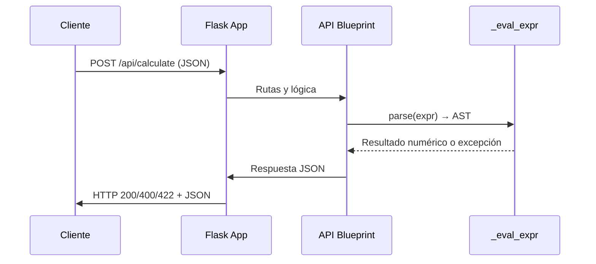

We need to produce markdown with sections. Use style guidelines. Provide tables and mermaid diagrams for architecture and endpoints. Provide installation steps. Provide data flow. Extensions future optional.

Let's craft.# Visión General del Proyecto

Este proyecto es una **API REST sencilla** que expone un único endpoint `/api/calculate`. Su objetivo principal es evaluar expresiones aritméticas proporcionadas por el cliente de forma segura, evitando la ejecución de código arbitrario. El backend está construido con **Flask**, y la lógica de evaluación se implementa mediante el módulo `ast` de Python para parsear y evaluar únicamente operadores matemáticos permitidos (`+`, `-`, `*`, `/`, `**` y unary minus).  

El flujo típico es:

1. El cliente envía una petición POST con un JSON que contiene la clave `"expression"`.
2. La API valida el tipo del dato, analiza la expresión con `ast.parse` en modo *eval*, y llama a `_eval_expr` para calcular el resultado.
3. Se devuelve un JSON con la clave `"result"` o, en caso de error, una descripción clara del problema.

El proyecto también incluye una carpeta estática (`frontend`) que sirve un archivo `index.html`. Esta capa estática actúa como punto de entrada simple y puede ser sustituida por cualquier front‑end SPA si se desea.

---

# Arquitectura del Sistema

La arquitectura sigue el patrón **Model-View-Controller (MVC)** simplificado, donde:

| Componente | Responsabilidad |
|------------|-----------------|
| **Flask App** (`app.py`, `__init__.py`) | Orquesta la aplicación, registra blueprints y sirve archivos estáticos. |
| **Blueprint de API** (`routes.py`) | Contiene las rutas REST y la lógica de negocio (evaluación segura). |
| **Parser AST** (`_eval_expr`) | Evalúa expresiones matemáticas de forma segura. |
| **Frontend estático** (`frontend/`) | Sirve el punto de entrada HTML/CSS/JS al usuario final. |

```mermaid
flowchart TD
    A[Cliente] --> B{HTTP POST /api/calculate}
    B --> C[Flask App]
    C --> D[Blueprint API]
    D --> E[_eval_expr (AST Parser)]
    E --> F[Resultado]
    F --> G[Respuesta JSON]
    G --> H[Cliente]
```

---

# Endpoints de la API

| Método | Ruta | Parámetros | Respuesta Exitosa | Código HTTP | Descripción |
|--------|------|------------|-------------------|-------------|-------------|
| `POST` | `/api/calculate` | `application/json`: `{ "expression": "<string>" }` | `{ "result": <number> }` | 200 OK | Evalúa la expresión aritmética y devuelve el resultado. |
| `POST` | `/api/calculate` | No válido o falta `expression` | `{ "error": "'expression' must be a string" }` | 400 Bad Request | Entrada mal formada. |
| `POST` | `/api/calculate` | Expresión inválida (sintaxis, tipo) | `{ "error": "Invalid expression" }` | 422 Unprocessable Entity | Error de evaluación. |
| `POST` | `/api/calculate` | División por cero | `{ "error": "division by zero" }` | 422 Unprocessable Entity | Operación aritmética no válida. |

**Ejemplo de petición:**

```bash
curl -X POST http://localhost:5000/api/calculate \
     -H 'Content-Type: application/json' \
     -d '{"expression":"2 + 3 * (4 - 1)"}'
```

**Respuesta esperada:**

```json
{ "result": 11 }
```

---

# Instrucciones de Instalación y Ejecución

1. **Clonar el repositorio**  
   ```bash
   git clone https://github.com/tu-usuario/proyecto-calculadora.git
   cd proyecto-calculadora
   ```

2. **Crear un entorno virtual (opcional pero recomendado)**  
   ```bash
   python3 -m venv .venv
   source .venv/bin/activate   # En Windows: .\.venv\Scripts\activate
   ```

3. **Instalar dependencias**  
   ```bash
   pip install Flask==2.0.3
   ```

4. **Ejecutar la aplicación en modo desarrollo**  
   ```bash
   export FLASK_APP=app.py      # En Windows: set FLASK_APP=app.py
   flask run --port 5000
   ```

5. **Probar el endpoint** (ejemplo con `curl`)  
   ```bash
   curl -X POST http://localhost:5000/api/calculate \
        -H 'Content-Type: application/json' \
        -d '{"expression":"10 / 2"}'
   ```

---

# Flujo de Datos Clave



1. **Recepción**: El cliente envía la expresión en el cuerpo de la petición.
2. **Parseo**: `ast.parse` convierte la cadena a un árbol sintáctico seguro.
3. **Evaluación**: `_eval_expr` recorre recursivamente el AST, permitiendo solo operadores definidos y lanzando excepciones para casos no soportados o errores aritméticos.
4. **Respuesta**: Se devuelve el resultado o un mensaje de error con el código HTTP apropiado.

---

# Extensiones Futuras (Opcional)

| Área | Posible Mejora | Justificación |
|------|----------------|---------------|
| **Seguridad y Validación** | Implementar una lista blanca más granular, restringir la longitud máxima de la expresión. | Evita ataques DoS por expresiones muy largas o complejas. |
| **Soporte a Funciones Matemáticas** | Añadir funciones como `sin`, `cos`, `sqrt` con un módulo seguro (`math`). | Amplía la utilidad sin sacrificar seguridad. |
| **Persistencia de Historial** | Guardar cada cálculo en una base de datos (SQLite) para auditoría o análisis. | Útil para aplicaciones que requieran trazabilidad. |
| **Autenticación y Rate‑Limiting** | Añadir tokens JWT y limitar peticiones por IP/usuario. | Mejora la escalabilidad y previene abuso. |
| **Front‑end SPA** | Migrar `frontend/index.html` a un framework como React o Vue, consumiendo la API. | Proporciona una UX más rica y modular. |

---