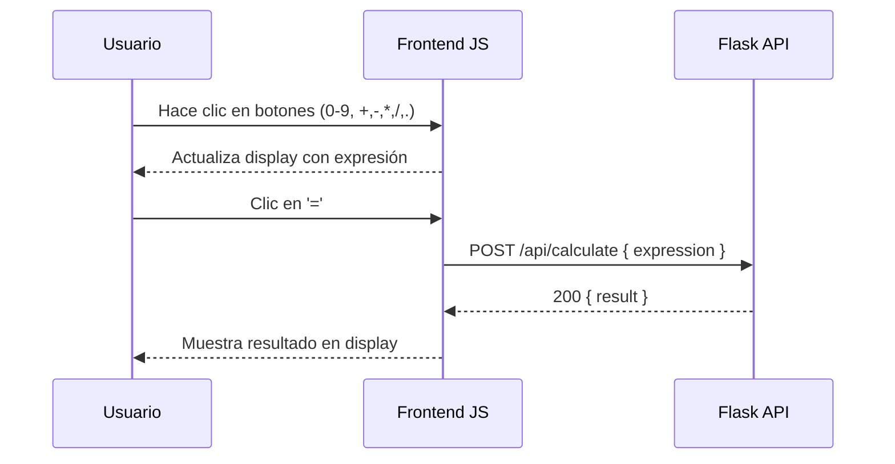

# Visión General del Proyecto

La calculadora web es una aplicación de una sola página (SPA) que permite a los usuarios introducir expresiones matemáticas y obtener resultados en tiempo real. El frontend está construido con HTML5, CSS3 y JavaScript ES6, sin dependencias externas ni frameworks. La lógica de cálculo se delega al backend Flask mediante una única llamada RESTful.

# Arquitectura del Sistema

El frontend sigue una arquitectura **MVC ligera**:

- **Modelo:** No aplica (el estado está en el componente JavaScript).
- **Vista:** Un único archivo `index.html` con un contenedor `.calculator`, una pantalla de display y un grid de botones.
- **Controlador:** Funciones JavaScript que manejan eventos de clic, construyen la expresión, actualizan la vista y realizan la llamada al backend.

La comunicación entre frontend y backend se realiza a través de `fetch` con formato JSON. El flujo de datos es:



# Endpoints de la API

| Método | Ruta            | Descripción                                      | Cuerpo de Solicitud                     | Respuesta (Ejemplo)                |
|--------|-----------------|---------------------------------------------------|-----------------------------------------|------------------------------------|
| POST   | `/api/calculate` | Calcula una expresión matemática segura.         | `{ "expression": "5*8-3" }`           | `{ "result": 37 }`                |

## Detalles de Implementación

- **Seguridad:** El backend debe evaluar la expresión usando `ast.literal_eval` o una librería segura para evitar inyección.
- **Manejo de Errores:** Si la expresión es inválida, el backend devuelve `400 Bad Request` con un mensaje JSON `{ "message": "Invalid expression" }`.

# Instrucciones de Instalación y Ejecución

1. Clonar el repositorio:

   ```bash
   git clone https://github.com/albertomzai/calculator.git
   cd calculator
   ```

2. Instalar las dependencias del backend (Flask):

   ```bash
   pip install -r requirements.txt
   ```

3. Iniciar el servidor Flask:

   ```bash
   flask run --host=0.0.0.0 --port=5000
   ```

4. Abrir `index.html` en un navegador:

   - Si el servidor está corriendo en la misma máquina, simplemente abra el archivo local.
   - Para acceder desde otro host, asegúrese de que `/api/calculate` esté accesible (p. ej., con CORS habilitado).

# Flujo de Datos Clave

1. **Entrada del Usuario:** Los botones generan eventos `click`. Cada valor se concatena a la variable `expression`.
2. **Actualización de la Vista:** La función `updateDisplay()` refleja el contenido actual de `expression` en el DOM.
3. **Solicitud al Backend:** Al presionar '=', la expresión completa se envía vía `POST /api/calculate`.
4. **Respuesta del Backend:** El JSON con `{ result: <valor> }` es recibido, convertido a string y reemplaza la expresión mostrada.

# Extensiones Futuras

- **Persistencia de Historial:** Añadir una tabla en el backend para guardar las últimas operaciones por sesión o usuario.
- **Soporte de Funciones Avanzadas:** Incluir funciones trigonométricas, exponenciación y paréntesis mediante un parser más robusto.
- **Internacionalización (i18n):** Cambiar la interfaz a múltiples idiomas sin reescribir el HTML.
- **Framework Frontend:** Migrar a React/Vue para una gestión de estado más estructurada en proyectos futuros.