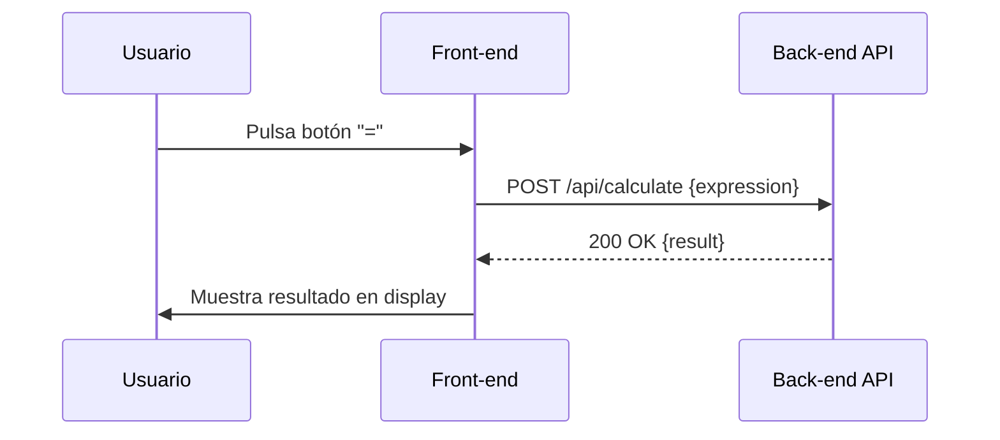

# Visión General del Proyecto

Calculadora Web es una aplicación de escritorio ligera construida con HTML, CSS y JavaScript puro, acompañada de Bootstrap 5 para estilos responsivos. Su objetivo principal es permitir a los usuarios realizar operaciones aritméticas básicas (suma, resta, multiplicación y división) directamente desde el navegador sin necesidad de instalar software adicional.

El flujo de interacción es sencillo:

1. El usuario pulsa botones numéricos y operadores en la interfaz.
2. La expresión se construye dinámicamente en el cliente, evitando secuencias inválidas como dos operadores consecutivos.
3. Al pulsar “=”, la expresión completa se envía al backend mediante una petición `POST /api/calculate`.
4. El servidor evalúa la expresión y devuelve el resultado, que se muestra en el display.

Esta arquitectura de *cliente‑servidor* separa claramente la lógica de presentación (HTML/JS) del procesamiento matemático, lo que facilita pruebas unitarias y posibles extensiones futuras.

---

# Arquitectura del Sistema

## Componentes Principales

| Componente | Descripción |
|------------|-------------|
| **Front‑end** | `index.html` con CSS en línea y JavaScript embebido. Utiliza Bootstrap 5 para la UI. |
| **Back‑end API** | EndPoint `/api/calculate` que recibe una expresión JSON, la evalúa y devuelve el resultado. (Implementación no incluida en el volcado) |
| **Comunicación** | HTTP/1.1 `POST` con cuerpo JSON; respuesta JSON con campo `result`. |

## Diagrama de Flujo



---

# Endpoints de la API

| Método | Ruta | Cuerpo de Solicitud | Respuesta |
|--------|------|---------------------|-----------|
| `POST` | `/api/calculate` | `{ "expression": "<string>" }`<br>Ejemplo: `{ "expression": "12+7*3" }` | `200 OK` con JSON `<{ "result": <number> }>`. En caso de error, se devuelve `400 Bad Request` con mensaje descriptivo. |

## Ejemplo de Uso

```bash
curl -X POST http://localhost:3000/api/calculate \
     -H 'Content-Type: application/json' \
     -d '{"expression":"12+7*3"}'
```

Respuesta:

```json
{ "result": 33 }
```

---

# Instrucciones de Instalación y Ejecución

1. **Clonar el repositorio**  
   ```bash
   git clone https://github.com/tuusuario/calculadora-web.git
   cd calculadora-web
   ```

2. **Instalar dependencias del backend (si aplica)**  
   ```bash
   npm install
   ```

3. **Iniciar el servidor**  
   ```bash
   node server.js  # o el comando que corresponda al framework usado
   ```

4. **Abrir la aplicación en el navegador**  
   Navega a `http://localhost:3000` (o al puerto configurado).

> **Nota:** Si solo deseas probar el front‑end sin backend, abre `index.html` directamente; las operaciones requerirán un endpoint funcional para calcular.

---

# Flujo de Datos Clave

1. **Entrada del Usuario**  
   - Los botones numerales y operadores actualizan la variable `expression` en memoria.
   - Se evita que se introduzcan operadores consecutivos modificando la cadena antes de concatenar.

2. **Petición al Backend**  
   ```js
   fetch('/api/calculate', {
       method: 'POST',
       headers: { 'Content-Type': 'application/json' },
       body: JSON.stringify({ expression })
   })
   ```

3. **Respuesta del Servidor**  
   - El servidor evalúa la expresión (por ejemplo, usando `eval` con sanitización o un parser seguro).
   - Devuelve `{ result: <valor> }`.

4. **Actualización de la UI**  
   ```js
   expression = data.result.toString();
   updateDisplay(expression);
   ```

---

# Extensiones Futuras

| Área | Propuesta |
|------|-----------|
| **Validación Avanzada** | Implementar un parser matemático (ej.: `math.js`) para evitar riesgos de `eval` y soportar funciones trigonométricas. |
| **Historial de Operaciones** | Guardar las expresiones y resultados en localStorage o base de datos, mostrando una lista editable. |
| **Modo Dark** | Añadir un toggle que cambie la paleta de colores usando CSS variables. |
| **Soporte Móvil** | Optimizar el layout con media queries y pruebas en dispositivos reales. |
| **API RESTful Completa** | Exponer endpoints adicionales (`/history`, `/clear`) para gestionar sesiones y datos del usuario. |

---