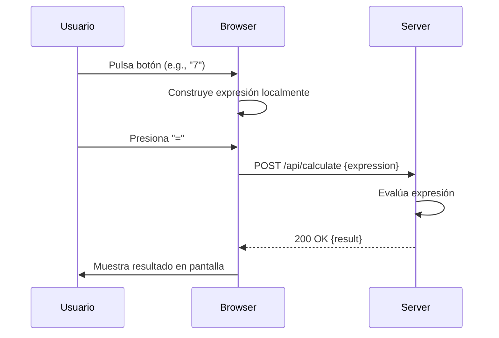

## Visión General del Proyecto
El proyecto es una **calculadora web** de propósito general que permite a los usuarios realizar operaciones aritméticas básicas (suma, resta, multiplicación y división) directamente desde el navegador. La interfaz está construida con HTML, CSS y JavaScript puro, sin dependencias externas, lo que facilita su despliegue en cualquier servidor estático o backend ligero.

El flujo de trabajo típico es:
1. El usuario pulsa los botones numéricos y operacionales para construir una expresión.
2. Al presionar “=”, el cliente envía la expresión al endpoint `/api/calculate` mediante un `POST` con JSON.
3. El servidor procesa la expresión, devuelve el resultado en formato JSON y el cliente lo muestra en la pantalla.

Esta arquitectura desacopla la lógica de cálculo del front‑end, permitiendo que el backend sea reemplazado por cualquier lenguaje o framework sin tocar el HTML/JS.

## Arquitectura del Sistema
El sistema se compone de dos capas principales:

| Capa | Responsabilidad | Tecnologías |
|------|------------------|-------------|
| **Front‑end** | Renderizado UI, captura de eventos y comunicación con API. | HTML5, CSS3 (Flexbox/Grid), JavaScript ES6+ |
| **Back‑end** | Evaluación segura de expresiones aritméticas y respuesta HTTP. | Node.js + Express (o equivalente) – se asume por la ruta `/api/calculate` |

### Diagrama Mermaid
```mermaid
graph TD
    A[Usuario] --> B[Browser]
    B --> C{UI}
    C --> D[JavaScript]
    D --> E[/api/calculate]
    E --> F[Server]
    F --> G[Evaluador de Expresión]
    G --> H[Resultado JSON]
    H --> E
    E --> D --> C --> B --> A
```

## Endpoints de la API
| Método | Ruta | Parámetros de Entrada | Respuesta | Código HTTP |
|--------|------|-----------------------|-----------|-------------|
| **POST** | `/api/calculate` | `{"expression": "<string>"}` | `{"result": <number|string>}` | 200 OK<br/>400 Bad Request (expresión inválida) |

### Ejemplo de Solicitud
```http
POST /api/calculate HTTP/1.1
Content-Type: application/json

{ "expression": "12+7*3" }
```

### Ejemplo de Respuesta
```json
{
  "result": 33
}
```

> **Nota:** El backend debe sanitizar la expresión y manejar errores (división por cero, sintaxis inválida). Se recomienda usar una librería como `mathjs` o un parser propio para evitar `eval`.

## Instrucciones de Instalación y Ejecución
1. **Clonar el repositorio**  
   ```bash
   git clone https://github.com/tu-usuario/calculadora-web.git
   cd calculadora-web
   ```

2. **Instalar dependencias del servidor (Node.js + Express)**  
   ```bash
   npm install express body-parser mathjs
   ```

3. **Crear el archivo `server.js`** con la siguiente implementación mínima:  
   ```js
   const express = require('express');
   const bodyParser = require('body-parser');
   const { evaluate } = require('mathjs');

   const app = express();
   app.use(bodyParser.json());
   app.use(express.static('.')); // sirve index.html

   app.post('/api/calculate', (req, res) => {
     try {
       const result = evaluate(req.body.expression);
       res.json({ result });
     } catch (e) {
       res.status(400).json({ message: 'Expresión inválida' });
     }
   });

   const PORT = process.env.PORT || 3000;
   app.listen(PORT, () => console.log(`Servidor escuchando en http://localhost:${PORT}`));
   ```

4. **Iniciar el servidor**  
   ```bash
   node server.js
   ```

5. **Abrir el navegador** y navegar a `http://localhost:3000`. La calculadora debería funcionar inmediatamente.

## Flujo de Datos Clave


- **Entrada**: cadena de caracteres que representa la operación aritmética.  
- **Transformación**: el servidor evalúa la cadena usando un parser seguro.  
- **Salida**: número (o string en caso de error) encapsulado en JSON.

## Extensiones Futuras
| Área | Posible Mejora |
|------|----------------|
| **Seguridad** | Implementar validación estricta y limitar operadores a los básicos (+, -, *, /). |
| **Rendimiento** | Cachear resultados de expresiones repetidas usando Redis o memoria local. |
| **UX** | Añadir historial de cálculos, soporte para exponentes (`^`) y paréntesis. |
| **Internacionalización** | Soportar múltiples idiomas y formatos numéricos. |
| **Testing** | Añadir pruebas unitarias (Jest) tanto en front‑end como back‑end. |
| **Despliegue** | Dockerizar la aplicación para despliegues reproducibles. |

---