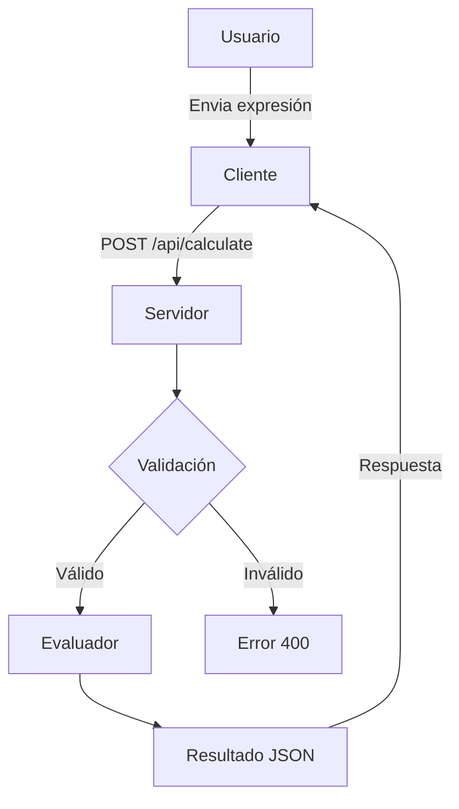
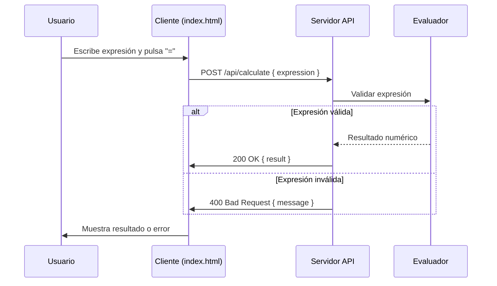

# Visión General del Proyecto

Calculadora Web es una aplicación de cliente‑servidor sencilla que permite a los usuarios evaluar expresiones aritméticas básicas (+, −, ×, ÷) desde un navegador.  
El front‑end está compuesto por un único archivo `index.html` que utiliza Bootstrap 5 para el estilo y JavaScript puro para la lógica de entrada. Cuando el usuario pulsa **=**, se envía una petición POST a `/api/calculate`. El back‑end (no incluido en el volcado) recibe la expresión, la evalúa con seguridad y devuelve el resultado o un mensaje de error.

El objetivo es ofrecer una experiencia ligera: el cliente solo necesita abrir el archivo HTML y el servidor expone una única ruta REST que realiza la operación. Esta arquitectura facilita su despliegue en cualquier entorno que soporte Node.js/Express, Python/Flask, Go o incluso un servicio sin servidor (serverless).

---

# Arquitectura del Sistema

## 1️⃣ Estructura de Archivos
```
.
├── index.html          # Front‑end estático con UI y lógica JS
└── server/*            # Código backend (no incluido)
    ├── app.js          # Punto de entrada (Node/Express)
    ├── routes/
    │   └── calculate.js  # Lógica de cálculo
    └── utils/
        └── validator.js  # Validación y sanitización
```

## 2️⃣ Componentes Clave

| Componente | Función | Tecnologías |
|------------|---------|-------------|
| **Cliente** | Interfaz de usuario, captura entrada, envía petición | HTML5, Bootstrap 5, JavaScript ES6 |
| **API /api/calculate** | Recepción y procesamiento de la expresión | HTTP/JSON, REST |
| **Lógica de cálculo** | Validación → Evaluación → Respuesta | Lenguaje del backend (Node.js, Python…) |
| **Seguridad** | Evitar `eval` inseguro, limitar operadores | Whitelisting, expresiones regulares |

## 3️⃣ Diagrama Mermaid



---

# Endpoints de la API

## `/api/calculate` (POST)

| Método | Ruta | Descripción |
|--------|------|-------------|
| POST   | `/api/calculate` | Evalúa una expresión aritmética enviada en el cuerpo JSON. |

### 1️⃣ Especificación del Request

```json
{
  "expression": "<cadena>"
}
```

- `expression`: Cadena que contiene números, puntos decimales y operadores `+`, `-`, `*`, `/`.  
- No se permiten espacios ni caracteres especiales.

### 2️⃣ Respuestas

| Código | Tipo | Cuerpo |
|--------|------|--------|
| **200 OK** | `application/json` | `{ "result": "<valor>" }` |
| **400 Bad Request** | `application/json` | `{ "message": "Expresión inválida" }` |
| **500 Internal Server Error** | `application/json` | `{ "message": "Error interno" }` |

### 3️⃣ Ejemplo de Uso

```bash
curl -X POST http://localhost:3000/api/calculate \
     -H "Content-Type: application/json" \
     -d '{"expression":"12+7*5"}'
```

Respuesta:

```json
{ "result": 47 }
```

---

# Instrucciones de Instalación y Ejecución

1. **Clonar el repositorio**  
   ```bash
   git clone https://github.com/usuario/calculadora-web.git
   cd calculadora-web
   ```

2. **Instalar dependencias del backend (Node.js)**  
   ```bash
   npm install
   ```

3. **Iniciar el servidor**  
   ```bash
   npm start
   ```
   El API escuchará en `http://localhost:3000`.

4. **Abrir la interfaz de usuario**  
   - Navegar a `index.html` directamente desde tu navegador (por ejemplo, arrastrar el archivo al navegador) o servirlo con un servidor estático:
     ```bash
     npx serve .
     ```
   - Acceder a `http://localhost:5000/index.html`.

5. **Probar la calculadora**  
   - Escribe una expresión y pulsa `=`; el resultado aparecerá en la pantalla.

---

# Flujo de Datos Clave



1. **Entrada**: Usuario escribe en la pantalla del cliente.  
2. **Petición**: Cliente envía expresión al endpoint `/api/calculate`.  
3. **Validación**: El servidor comprueba que la cadena solo contiene caracteres permitidos.  
4. **Evaluación**: Se calcula el valor usando una implementación segura (no `eval`).  
5. **Respuesta**: Se devuelve JSON con el resultado o un mensaje de error.  
6. **Salida**: Cliente muestra el resultado en la pantalla.

---

# Extensiones Futuras

| Área | Idea | Beneficio |
|------|------|-----------|
| **Soporte de funciones matemáticas** | Añadir `sin`, `cos`, `sqrt`, etc., con una API `/api/calculate` extendida. | Mayor utilidad para usuarios avanzados. |
| **Historial de cálculos** | Persistir expresiones y resultados en localStorage o base de datos; mostrar tabla de historial. | Mejora la experiencia del usuario. |
| **API Gateway / Rate Limiting** | Implementar límites por IP para evitar abuso. | Seguridad y estabilidad. |
| **Frontend SPA** | Migrar a React/Vue con componentes reutilizables. | Mejor mantenibilidad y escalabilidad. |
| **Serverless Deployment** | Desplegar la API en AWS Lambda / Vercel Functions. | Escalado automático sin servidor. |

---