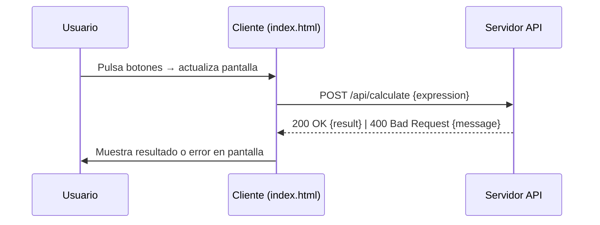

# Visión General del Proyecto

El proyecto es una **calculadora web** simple que permite a los usuarios ingresar expresiones aritméticas y obtener resultados mediante una API backend. La interfaz de usuario está construida con HTML, CSS y JavaScript puro, sin frameworks front-end. El cálculo real se delega al servidor a través de un endpoint `/api/calculate`, lo que facilita la validación y el manejo seguro de las expresiones.

- **Front‑end**: Un único archivo `index.html` que contiene todo el markup, estilos y lógica del cliente.
- **Back‑end**: No se incluye en el volcado actual; se asume un servicio REST que expone `/api/calculate`.
- **Lenguaje**: JavaScript (ES6+) para la lógica del cliente; CSS variables para temas y diseño responsivo.

El flujo típico es:
1. El usuario pulsa botones numéricos y operadores.
2. La expresión se concatena en una variable `expression` y se muestra en la pantalla.
3. Al pulsar “=”, el cliente valida localmente la sintaxis y envía la expresión al backend.
4. El servidor devuelve el resultado o un mensaje de error, que se muestra al usuario.

---

# Arquitectura del Sistema

## 1. Componentes principales

| Componente | Responsabilidad | Tecnologías |
|------------|-----------------|-------------|
| **Cliente** | Interfaz de usuario y envío de peticiones HTTP | HTML5, CSS3 (variables), JavaScript ES6 |
| **Servidor API** | Evaluación segura de expresiones y retorno del resultado | Node.js/Express (posible) o cualquier framework REST |
| **Persistencia** | No aplica; la calculadora es stateless | N/A |

## 2. Flujo de comunicación



## 3. Validación y seguridad

- **Validación local**: Expresión debe coincidir con `/^[0-9+\-*/().\s]+$/`.
- **Manejo de errores**: Si la respuesta del servidor no es OK, se muestra el mensaje recibido.
- **Reseteo**: La variable `expression` se borra después de cada cálculo o error.

---

# Endpoints de la API

| Método | Ruta | Parámetros | Cuerpo | Respuesta |
|--------|------|------------|--------|-----------|
| `POST` | `/api/calculate` | N/A | `{ "expression": "<string>" }` | `200 OK { "result": <number|string> }`<br>`400 Bad Request { "message": "<error>" }` |

### Ejemplo de petición

```http
POST /api/calculate HTTP/1.1
Content-Type: application/json

{ "expression": "(2+3)*4" }
```

### Ejemplo de respuesta exitosa

```json
{
  "result": 20
}
```

### Ejemplo de respuesta con error

```json
{
  "message": "Invalid expression"
}
```

---

# Instrucciones de Instalación y Ejecución

1. **Clonar el repositorio**  
   ```bash
   git clone https://github.com/tu-usuario/calculadora-web.git
   cd calculadora-web
   ```

2. **Instalar dependencias del backend (si aplica)**  
   ```bash
   npm install
   ```

3. **Iniciar el servidor API**  
   ```bash
   node server.js   # o npm start según tu configuración
   ```

4. **Servir la interfaz de usuario**  
   - Si el servidor también sirve archivos estáticos: abre `http://localhost:3000` (o el puerto configurado).
   - Alternativamente, usa un servidor simple:  
     ```bash
     npx serve .
     ```

5. **Probar la calculadora**  
   Abre el navegador y navega a la URL servida; interactúa con los botones para evaluar expresiones.

---

# Flujo de Datos Clave

1. **Entrada del usuario** → Botones HTML (`data-value`) → `updateScreen(value)`
2. **Construcción de expresión** → Variable global `expression`
3. **Validación local** → `isValidExpression(expression)`
4. **Envío al servidor** → `fetch('/api/calculate', ...)` con cuerpo JSON
5. **Respuesta del servidor** → Se procesa en `calculateResult()`
6. **Salida** → Actualiza el elemento DOM `#screen`

---

# Extensiones Futuras

| Área | Posible mejora |
|------|----------------|
| **Persistencia de historial** | Guardar expresiones y resultados en localStorage o base de datos para permitir revisiones posteriores. |
| **Soporte de funciones trigonométricas** | Añadir botones `sin`, `cos`, `tan` y ampliar la validación y evaluación del backend. |
| **Modo oscuro / tema personalizado** | Permitir al usuario cambiar colores mediante CSS variables dinámicas. |
| **API de cálculo más robusta** | Implementar un parser seguro (por ejemplo, Math.js) para evitar inyecciones y manejar expresiones complejas. |
| **Tests automatizados** | Añadir pruebas unitarias en el cliente (Jest + jsdom) y en el servidor (Supertest). |

---