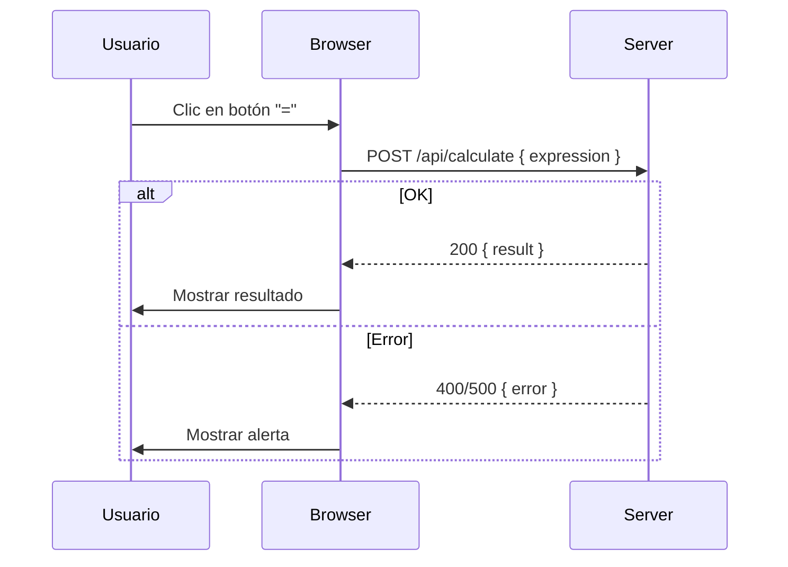

# Visión General del Proyecto

El proyecto es una **calculadora web** sencilla que permite a los usuarios realizar operaciones aritméticas básicas (suma, resta, multiplicación y división) directamente desde el navegador. La interfaz está construida con HTML5, CSS personalizado y Bootstrap 5 para garantizar un diseño responsivo y atractivo. El cálculo real se delega al servidor mediante una llamada RESTful (`POST /api/calculate`), lo que facilita la validación de la expresión y la protección contra inyecciones o errores de sintaxis.

## Características principales

| Funcionalidad | Descripción |
|---------------|-------------|
| **Interfaz intuitiva** | Botones numéricos, operadores y un botón “C” para limpiar. |
| **Validación del cliente** | Evita múltiples puntos decimales consecutivos y actualiza la pantalla de forma reactiva. |
| **Comunicación con el servidor** | Envío de la expresión como JSON; recepción del resultado o de mensajes de error. |
| **Manejo de errores** | Alertas Bootstrap que desaparecen automáticamente tras 3 s. |

---

# Arquitectura del Sistema

El sistema sigue una arquitectura cliente‑servidor simple:

```
Cliente (navegador) <───> Servidor HTTP (API)
```

## Componentes

| Componente | Tecnología | Responsabilidad |
|------------|------------|-----------------|
| **Front‑end** | HTML5, CSS, JavaScript, Bootstrap 5 | Renderiza la calculadora y gestiona eventos de usuario. |
| **Back‑end** | Node.js / Express (o equivalente) | Expone `/api/calculate`, valida y evalúa expresiones, devuelve resultados en JSON. |

### Diagrama Mermaid



---

# Endpoints de la API

| Método | Ruta | Descripción | Parámetros (JSON) | Respuesta (JSON) |
|--------|------|-------------|-------------------|------------------|
| **POST** | `/api/calculate` | Evalúa una expresión aritmética. | `{"expression":"3+4*2"}` | `{"result":11}` |
|  |  |  |  | En caso de error: `{"error":"Mensaje descriptivo"}` |

## Ejemplo de uso con cURL

```bash
curl -X POST http://localhost:3000/api/calculate \
     -H "Content-Type: application/json" \
     -d '{"expression":"12/4+3*2"}'
```

Respuesta:

```json
{
  "result": 10
}
```

---

# Instrucciones de Instalación y Ejecución

1. **Clonar el repositorio**  
   ```bash
   git clone https://github.com/tu-usuario/calculadora-web.git
   cd calculadora-web
   ```

2. **Instalar dependencias del servidor** (suponiendo Node.js)  
   ```bash
   npm install
   ```

3. **Configurar variables de entorno** *(opcional)*  
   - Crear un archivo `.env` con la variable `PORT=3000`.

4. **Iniciar el servidor**  
   ```bash
   npm start
   ```

5. **Abrir la aplicación**  
   Navega a `http://localhost:3000` en tu navegador.

---

# Flujo de Datos Clave

1. El usuario escribe una expresión usando los botones.
2. JavaScript actualiza el campo de pantalla y mantiene la cadena `expression`.
3. Al pulsar “=”, se envía un **POST** a `/api/calculate` con `{ expression }`.
4. El servidor valida la sintaxis, evalúa la expresión y devuelve `{ result }`.
5. El cliente muestra el resultado en la pantalla; si ocurre un error, se despliega una alerta.

---

# Extensiones Futuras

| Área | Posible mejora |
|------|----------------|
| **Seguridad** | Validar expresiones con una librería de parsing (e.g., `mathjs`) para evitar evaluaciones peligrosas. |
| **Persistencia** | Guardar historial de cálculos en localStorage o base de datos. |
| **Internacionalización** | Añadir soporte multilingüe usando i18next. |
| **API REST completa** | Implementar endpoints GET `/history`, DELETE `/clear-history`. |
| **Testing** | Agregar pruebas unitarias (Jest) tanto para el front‑end como para la API. |

---