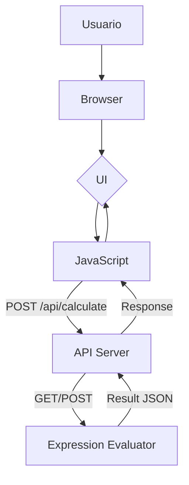
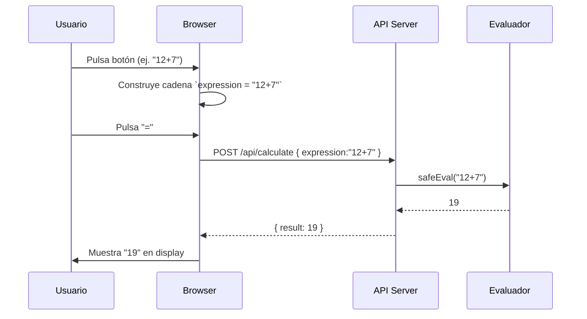

# Visión General del Proyecto

El proyecto es una **calculadora web sencilla** que permite al usuario ingresar expresiones aritméticas mediante un teclado virtual y obtener el resultado de forma dinámica sin recargar la página. La interfaz está construida con HTML, CSS (Bootstrap 5) y JavaScript puro. El cálculo se delega a una API REST (`/api/calculate`) que recibe la expresión como JSON y devuelve el valor numérico calculado.

El flujo típico es:

1. **Usuario** pulsa botones → se construye una cadena de texto `expression`.
2. Al pulsar “=” se envía un POST a `/api/calculate` con `{ expression }`.
3. El servidor procesa la expresión, devuelve `{ result: <valor> }`.
4. El cliente muestra el resultado en el display.

Esta arquitectura separa claramente la capa **presentación** (frontend) de la lógica **de negocio** (API), lo que facilita mantenimiento y pruebas unitarias.

---

# Arquitectura del Sistema

## 1. Componentes Principales

| Componente | Tecnología | Responsabilidad |
|------------|-------------|-----------------|
| **Frontend** | HTML5 + Bootstrap 5 + Vanilla JS | Renderiza la calculadora, captura eventos de botón y muestra resultados. |
| **Backend API** | Node.js (Express) / Python (Flask) / Go (net/http) – cualquiera que exponga `/api/calculate` | Evalúa expresiones aritméticas seguras y devuelve el resultado en JSON. |
| **Servidor Web** | Nginx/Apache o el mismo servidor de la API | Sirve `index.html`, archivos estáticos y reenvía peticiones a la API. |

## 2. Diagrama Mermaid



---

# Endpoints de la API

| Método | Ruta | Parámetros de Entrada | Respuesta | Código de Estado |
|--------|------|-----------------------|-----------|------------------|
| **POST** | `/api/calculate` | `application/json`<br>`{ "expression": "<cadena>" }` | `application/json`<br>`{ "result": <número> }` | 200 OK |
| | | | En caso de error: `<json>{ "error":"mensaje" }</json>` | 400 Bad Request |

**Ejemplo de solicitud**

```bash
curl -X POST http://localhost:3000/api/calculate \
     -H "Content-Type: application/json" \
     -d '{"expression":"12+7*3"}'
```

**Respuesta esperada**

```json
{ "result": 33 }
```

---

# Instrucciones de Instalación y Ejecución

1. **Clonar el repositorio**
   ```bash
   git clone https://github.com/tuusuario/calculadora-web.git
   cd calculadora-web
   ```

2. **Instalar dependencias del backend**  
   (Ejemplo con Node.js + Express)
   ```bash
   npm install express body-parser cors
   ```

3. **Crear el archivo `server.js`** con el siguiente contenido mínimo:

   ```js
   const express = require('express');
   const bodyParser = require('body-parser');
   const app = express();
   const port = 3000;

   app.use(bodyParser.json());

   // Evaluador seguro (solo números y operadores básicos)
   function safeEval(expr) {
     if (!/^[\d+\-*/().\s]+$/.test(expr)) throw new Error('Expresión inválida');
     return Function(`'use strict';return (${expr})`)();
   }

   app.post('/api/calculate', (req, res) => {
     const { expression } = req.body;
     try {
       const result = safeEval(expression);
       res.json({ result });
     } catch (e) {
       res.status(400).json({ error: e.message });
     }
   });

   app.use(express.static('.')); // Sirve index.html y assets

   app.listen(port, () => console.log(`Servidor escuchando en http://localhost:${port}`));
   ```

4. **Ejecutar el servidor**
   ```bash
   node server.js
   ```

5. Abrir un navegador y acceder a `http://localhost:3000`. La calculadora ya debe funcionar.

---

# Flujo de Datos Clave



---

# Extensiones Futuras (Opcional)

| Área | Posible Mejora |
|------|----------------|
| **Seguridad** | Implementar un parser de expresiones propio para evitar `Function` y permitir funciones matemáticas (`sin`, `cos`). |
| **Persistencia** | Guardar historial de cálculos en localStorage o base de datos para mostrar al usuario. |
| **Internacionalización** | Soportar diferentes idiomas y formatos numéricos (punto/coma). |
| **Accesibilidad** | Añadir soporte ARIA, teclado y lectores de pantalla. |
| **API REST completa** | Exponer endpoints `GET /history`, `DELETE /history/:id` para gestión del historial. |

---