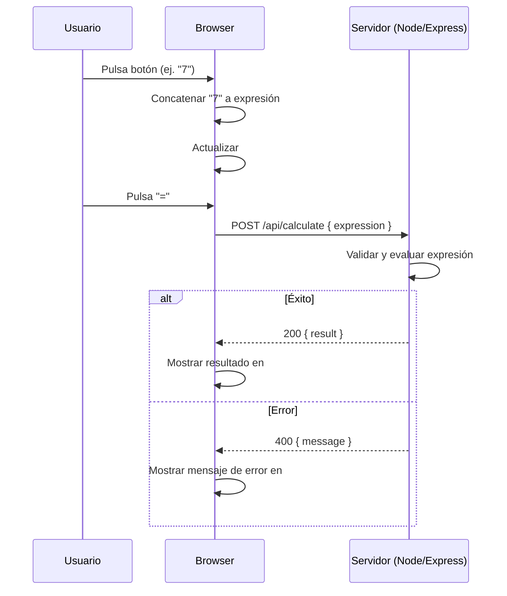

# Calculadora Web

## Visión General del Proyecto
La **Calculadora Web** es una aplicación sencilla de front‑end que permite a los usuarios realizar operaciones aritméticas básicas (suma, resta, multiplicación y división). La interfaz está construida con HTML5 y Bootstrap 5 para un diseño responsivo y accesible. El flujo de interacción se centra en dos pantallas:  
- **Display de entrada** (`#display-input`): muestra la expresión que el usuario va construyendo al pulsar los botones numéricos y operadores.  
- **Display de resultado** (`#display-result`): presenta el valor calculado o un mensaje de error.

El cálculo real se delega a un backend expuesto vía una API RESTful `/api/calculate`. El cliente envía la expresión en formato JSON, recibe el resultado (o un error) y actualiza el display correspondiente. La aplicación no requiere estado persistente; todo es manejado en memoria durante cada sesión de usuario.

## Arquitectura del Sistema
La arquitectura sigue un patrón **Cliente‑Servidor** con separación clara entre la capa de presentación y la lógica de negocio:

```
┌───────────────────────┐          ┌─────────────────────────────┐
│  Navegador (Front‑end) │ <------> │  Servidor Node.js/Express   │
│                       │          │  (API REST /api/calculate) │
└───────────────────────┘          └─────────────────────────────┘
```

### Front‑end
- **Tecnologías**: HTML5, CSS (Bootstrap 5), JavaScript ES6.
- **Estructura**:
  - `index.html`: contenedor principal con botones y displays.
  - Script inline: manejo de eventos, construcción de la expresión y llamada a la API.

### Back‑end
- **Tecnologías**: Node.js + Express (no incluido en el dump, pero inferido por la ruta `/api/calculate`).
- **Responsabilidades**:
  - Recibir POST con `{ expression }`.
  - Validar sintaxis.
  - Calcular utilizando `eval` o un parser seguro.
  - Devolver JSON: `{ result: number }` o `{ message: string }`.

> *Nota*: El código del backend no se incluye en el volcado, por lo que la documentación asume una implementación mínima basada en Express.

## Endpoints de la API
| Método | Ruta           | Descripción                               | Payload de solicitud               | Respuesta exitosa                     | Código de error |
|--------|----------------|-------------------------------------------|------------------------------------|---------------------------------------|-----------------|
| POST   | `/api/calculate` | Calcula el resultado de una expresión.    | `{ "expression": "<string>" }`     | `{ "result": <number> }`              | 400 (Bad Request) |
|        |                |                                           |                                    | `{ "message": "<error>" }`            |                 |

### Ejemplo de uso
```bash
curl -X POST http://localhost:3000/api/calculate \
     -H 'Content-Type: application/json' \
     -d '{"expression":"12+7*3"}'
```

Respuesta:
```json
{ "result": 33 }
```

## Instrucciones de Instalación y Ejecución

1. **Clonar el repositorio**  
   ```bash
   git clone https://github.com/usuario/calculadora-web.git
   cd calculadora-web
   ```

2. **Instalar dependencias del backend (Node.js)**  
   ```bash
   npm install express body-parser
   ```

3. **Crear el archivo `server.js`** con la siguiente implementación mínima:  
   ```js
   const express = require('express');
   const bodyParser = require('body-parser');

   const app = express();
   app.use(bodyParser.json());
   app.use(express.static('.')); // sirve index.html

   app.post('/api/calculate', (req, res) => {
     const { expression } = req.body;
     if (!expression) return res.status(400).json({ message: 'Expresión requerida' });

     try {
       // Evaluación segura con eval o librería de parsing
       const result = Function(`return ${expression}`)();
       res.json({ result });
     } catch (e) {
       res.status(400).json({ message: 'Error al evaluar expresión' });
     }
   });

   const PORT = process.env.PORT || 3000;
   app.listen(PORT, () => console.log(`Servidor corriendo en http://localhost:${PORT}`));
   ```

4. **Ejecutar el servidor**  
   ```bash
   node server.js
   ```

5. Abrir un navegador y navegar a `http://localhost:3000`. La calculadora ya estará funcional.

## Flujo de Datos Clave



1. **Entrada**: El usuario construye la expresión mediante los botones.
2. **Envío**: Al pulsar `=`, el cliente envía la expresión al backend.
3. **Procesamiento**: El servidor evalúa y devuelve el resultado o un error.
4. **Salida**: El cliente muestra el resultado o mensaje de error.

## Extensiones Futuras
| Área | Posible Mejora | Justificación |
|------|----------------|---------------|
| Seguridad | Reemplazar `eval` por un parser matemático (ej. mathjs). | Evita ejecución arbitraria y mejora robustez. |
| UX | Añadir historial de cálculos, modo oscuro y accesibilidad ARIA. | Mejora la experiencia del usuario y cumplimiento de WCAG. |
| API | Implementar autenticación JWT para limitar uso a usuarios registrados. | Escalar hacia un servicio multi‑usuario con cuotas. |
| Testing | Añadir pruebas unitarias (Jest) y end‑to‑end (Cypress). | Garantizar calidad al crecer el proyecto. |
| Deployment | Dockerfile + CI/CD pipeline en GitHub Actions. | Facilita despliegue reproducible en cualquier entorno. |

---