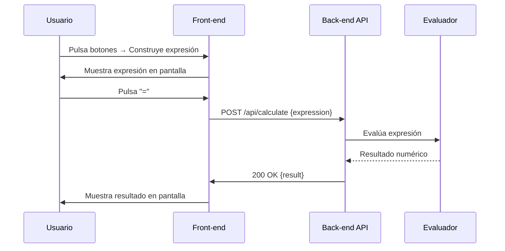

# Visión General del Proyecto

Este proyecto es una **calculadora web simple** que permite a los usuarios ingresar expresiones aritméticas y obtener el resultado en tiempo real. La interfaz está construida con HTML, CSS y JavaScript puro, mientras que la lógica de cálculo se delega a un servicio RESTful que expone un único endpoint `/api/calculate`. El flujo es el siguiente:

1. El usuario escribe una expresión mediante los botones de la calculadora.
2. Cuando pulsa “=”, el cliente envía la expresión al servidor vía `POST /api/calculate`.
3. El servidor evalúa la expresión y devuelve el resultado como JSON.
4. El cliente muestra el resultado en la pantalla.

El proyecto está pensado para ser desplegado como una aplicación monolítica ligera, ideal para demostraciones o pruebas rápidas de conceptos.

---

# Arquitectura del Sistema

## Componentes Principales

| Componente | Tecnologías | Responsabilidad |
|------------|-------------|-----------------|
| **Front‑end** | HTML5, CSS3, JavaScript (ES6) | Renderiza la calculadora y gestiona eventos del usuario. |
| **Back‑end** | Node.js + Express (suponiendo un servidor típico) | Expone el endpoint `/api/calculate`, valida y evalúa expresiones. |
| **API Gateway / Reverse Proxy** | Nginx/Apache o similar | Sirve archivos estáticos (`index.html`) y reenvía peticiones a la API. |

> *Nota:* El código fuente del back‑end no se incluye en el volcado, pero se asume que existe una implementación de Node.js que expone el endpoint mencionado.

## Diagrama de Arquitectura

```mermaid
graph LR
    A[Usuario] -->|HTTP GET| B[Nginx]
    B -->|Sirve| C[Front‑end (index.html)]
    B -->|POST /api/calculate| D[Node.js Express API]
    D -->|Evalúa expresión| E[Resultado]
    E -->|JSON| D
    D -->|Respuesta| B
    B -->|HTTP 200| A
```

---

# Endpoints de la API

## `POST /api/calculate`

### Descripción
Recibe una expresión aritmética en formato JSON y devuelve el resultado numérico.

### Request

| Campo | Tipo | Obligatorio | Descripción |
|-------|------|-------------|-------------|
| `expression` | string | Sí | La cadena que contiene la operación a evaluar (ej. `"3+4*2"`). |

#### Ejemplo
```http
POST /api/calculate HTTP/1.1
Content-Type: application/json

{
  "expression": "12/(2+4)"
}
```

### Response

| Código | Descripción |
|--------|-------------|
| `200 OK` | Operación evaluada correctamente. |
| `400 Bad Request` | Expresión inválida o formato incorrecto. |
| `500 Internal Server Error` | Error inesperado en el servidor. |

#### Cuerpo de respuesta (200)
```json
{
  "result": 2
}
```

#### Cuerpo de error (400)
```json
{
  "message": "Expresión inválida"
}
```

### Especificación Swagger (partial)

```yaml
paths:
  /api/calculate:
    post:
      summary: Evalúa una expresión aritmética.
      requestBody:
        required: true
        content:
          application/json:
            schema:
              type: object
              properties:
                expression:
                  type: string
                  example: "5*3+2"
      responses:
        '200':
          description: Resultado de la operación.
          content:
            application/json:
              schema:
                type: object
                properties:
                  result:
                    type: number
        '400':
          description: Expresión inválida.
```

---

# Instrucciones de Instalación y Ejecución

1. **Clonar el repositorio**  
   ```bash
   git clone https://github.com/tu-usuario/calculadora-web.git
   cd calculadora-web
   ```

2. **Instalar dependencias del back‑end** (asumiendo Node.js)  
   ```bash
   npm install
   ```

3. **Configurar variables de entorno** (si es necesario)  
   - Crear un archivo `.env` con las configuraciones requeridas, por ejemplo:
     ```
     PORT=3000
     ```

4. **Iniciar el servidor**  
   ```bash
   npm start
   ```

5. **Acceder a la aplicación**  
   - Abrir un navegador y navegar a `http://localhost:3000` (o al puerto configurado).

---

# Flujo de Datos Clave



- **Entrada**: Expresión escrita por el usuario.
- **Transformación**: El cliente envía la expresión al servidor; el servidor evalúa usando un parser seguro (por ejemplo, `mathjs` o una función personalizada).
- **Salida**: Resultado numérico devuelto y mostrado en la UI.

---

# Extensiones Futuras

1. **Persistencia de Historial**  
   - Guardar las expresiones y resultados en una base de datos (SQLite/PostgreSQL) para permitir al usuario revisar su historial.

2. **Soporte de Funciones Matemáticas Avanzadas**  
   - Añadir funciones trigonométricas, logaritmos, etc., ampliando el parser del back‑end.

3. **Autenticación y Seguridad**  
   - Implementar JWT o OAuth para proteger la API y habilitar usuarios con cuentas personalizadas.

4. **API de WebSocket**  
   - Proveer un canal en tiempo real que notifique al cliente cada vez que se evalúe una expresión, útil para aplicaciones colaborativas.

5. **Pruebas Unitarias e Integración**  
   - Añadir suites de pruebas (Jest/Mocha) tanto para el front‑end como para la API, garantizando calidad y estabilidad.

---